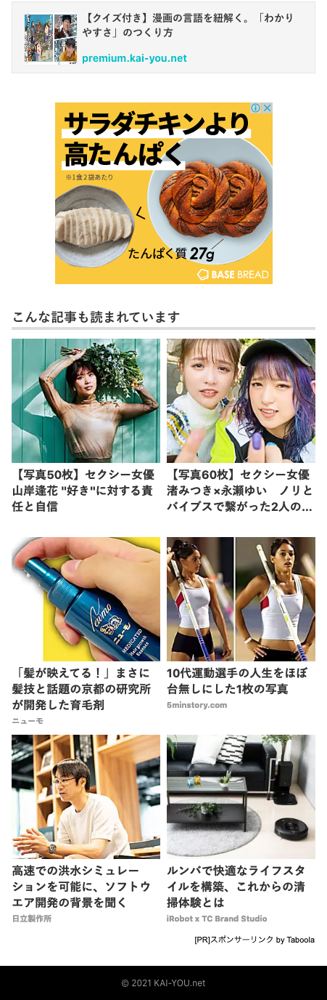
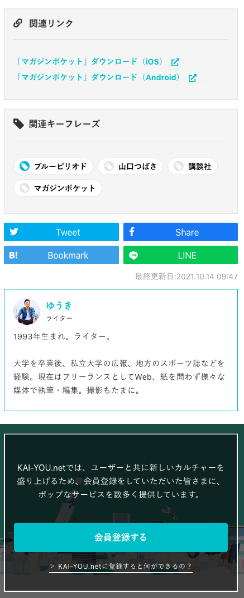

# 記事AMPページ（ https://kai-you.net/amp/article/* ）の表示コンテンツ拡充

## タスクの種類

既存ページの改善

---

### 課題

記事AMPページの表示コンテンツが正規記事ページに比べて少なく、検索エンジンに対してページ内コンテンツのアピールができていない。

### 目的

AMPページ表示コンテンツの拡充による検索流入数及び順位の向上。

### 作業内容

正規の記事ページ（ https://kai-you.net/article/* ）に表示されている、以下3要素のAMPページへの移植・AMPフォーマット対応作業。
- 文末の関連情報
- サイドバーの関連記事
- 週間 / 全体ランキング

AMPページ向けCSSの軽量化作業（75KB容量制限対策）。
- 全体的なCSS（SCSS）のリファクタリング・共通化
- font-awesome周りの記述を削除し、svgアイコンとしての表示に切り替え

### 確認URL

[https://kai-you.net/amp/article/81410](https://kai-you.net/amp/article/81410)

### 変更前デザイン

### 変更後デザイン

---

## YWT

#### わかったこと

AMPページのCSS容量上限・AMPページの仕様全般について。
- [スタイルとレイアウト - AMP](https://amp.dev/ja/documentation/guides-and-tutorials/develop/style_and_layout/)
- [Components - AMP](https://amp.dev/ja/documentation/components/)