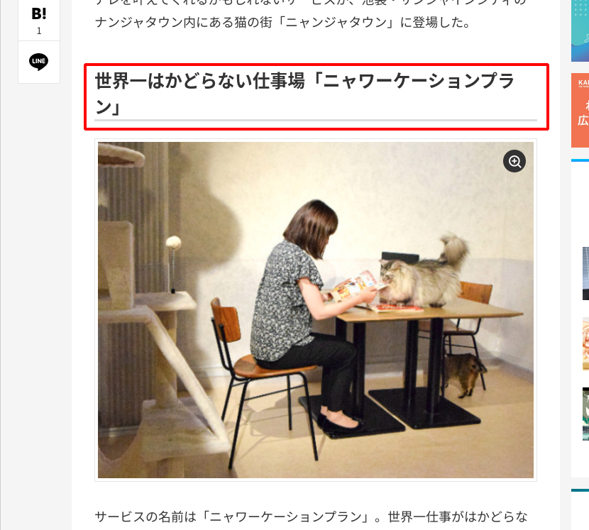
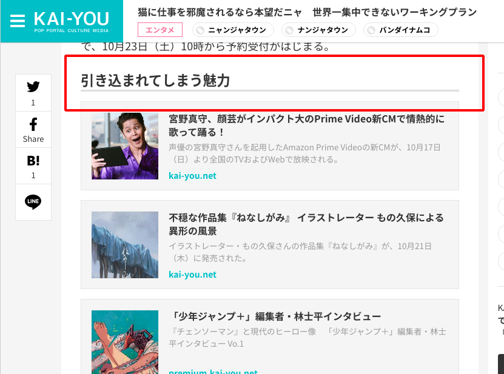

# 記事ページ（/article/〇〇）の見出し構造の変更

## タスクの種類

既存ページの改善

---

### 課題

記事本文内でh2タグを使用しておらずキレイな見出し構造になっていなかったため、SEO上問題となっている可能性があった。

### 目的

記事ページの検索流入の増加

### 作業内容

既存の本文内のh3タグをh2タグに変更、h4タグをh3タグに変更する。  
（上記作業を単純に行うとデザインの崩れが発生するので書き手順で行う）

- h2タグのフォントサイズをh3タグに揃えるcss変更
- h3タグをh3タグに一括で置換作業を行う
- h3タグのフォントサイズをh4タグに揃えるcss変更
- h4タグをh3タグに一括で置換作業を行う

### 確認URL

https://kai-you.net/article/81796

### 該当箇所

