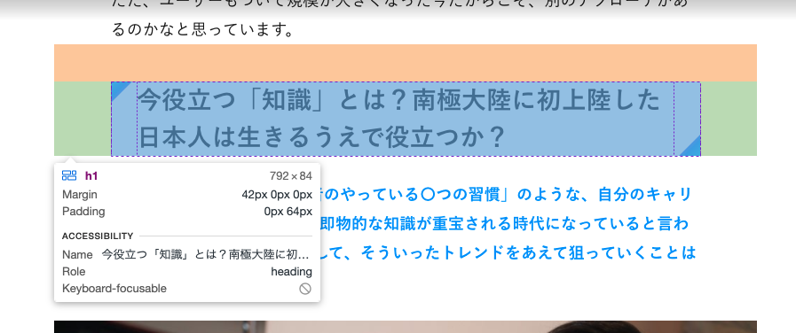
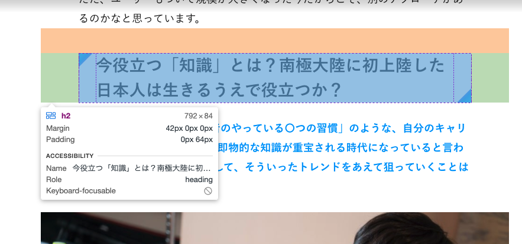

# Premium記事本文(premium.kai-you.net/article/〇〇)の見出し構造変更

## タスクの種類

既存ページの改善

## 課題

Premium記事本文内小見出しにh1タグを使っており、検索エンジン向けに最適化ができていない

## 目的

プレミアムページへの検索流入の向上

## 作業内容

#### Premium記事本文で利用されているh1からh5タグ（h6は未使用）をh2からh6を使うように変更する
- 記事本文内データのhタグの数字を一つ下げる変換処理の作成
- タグの変更に伴うcssの修正
- その他本文データhタグ情報を基に行うバックエンド処理の修正

## 確認URL

https://premium.kai-you.net/article/273

## 該当箇所

