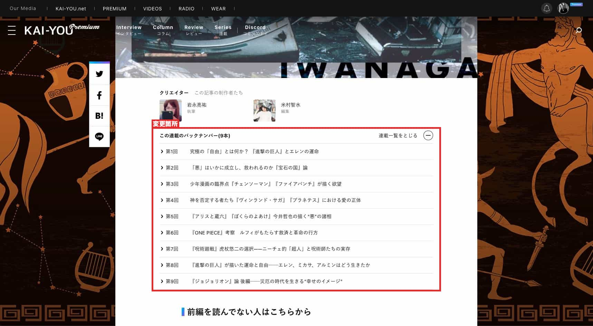

# Premium記事連載導線(premium.kai-you.net/article/〇〇)の改修

## タスクの種類
既存ページの改善

## 課題
クリックして連載一覧へ→そこから新たに記事を探す行動のハードルが高いのではないか

## 目的
- いま開いている記事が連載に含まれているものだということをより周知させたい
- 読み始め、読み終わりにスムーズな流れで同連載記事にユーザーが遷移できるように（興味の継続）
- より多くの記事を読んでもらうことで、サービスに対しての満足感を得てもらいたい

## 作業内容
#### 連載一覧だけでなく、それぞれの記事を表側に出すようにしたい
- 連載導線のレイアウト改修
- 開閉動作の追加

## 確認URL
[https://premium.kai-you.net/article/435](https://premium.kai-you.net/article/435)

## 該当箇所

