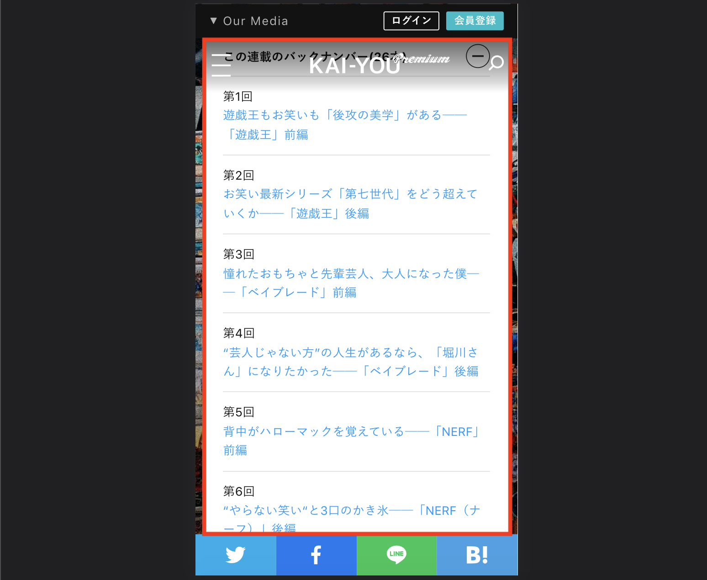
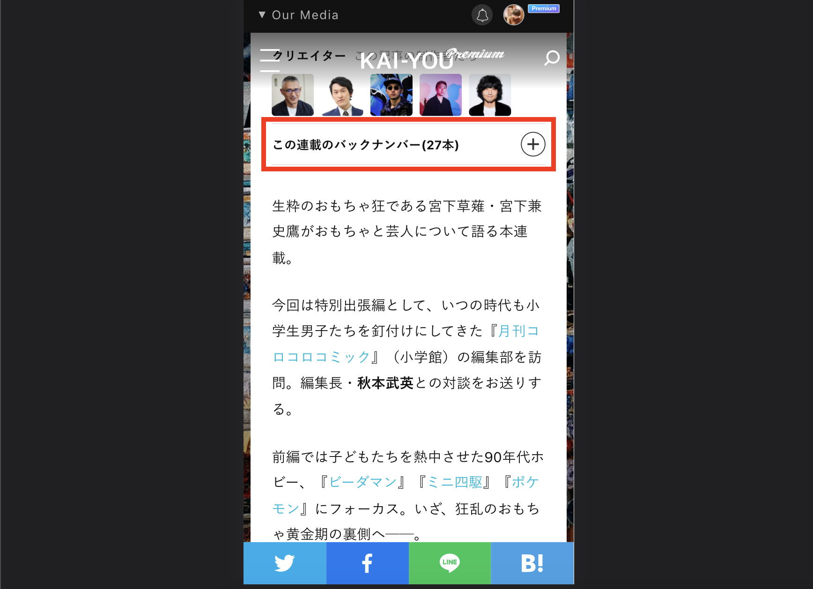
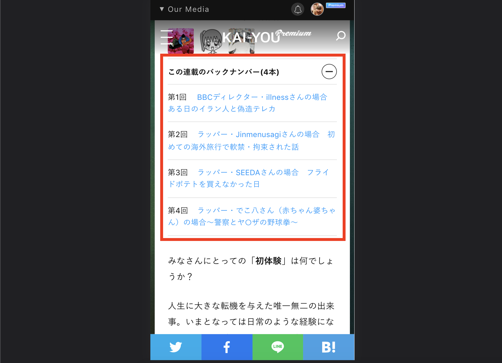

# KAI-YOU Premium記事 連載一覧UIの改修

## タスクの種類
既存ページUIの改善

---

### 課題
連載一覧にある記事本数が多数の場合、連載一覧のみで画面を埋め尽くしてしまい、ユーザー体験が著しく低下する

### 目的
- すぐに記事内容へ遷移できるようなデザインに変更する

### 作業内容
- 連載一覧の記事本数が5つ以上の場合に連載一覧は閉じた状態で表示(4つ以下はクローズしない)
- 連載一覧にある各記事の文章配置を修正

### 確認URL
[[記事本数5つ以上]](https://premium.kai-you.net/article/402)

[[記事本数4つ以下]](https://premium.kai-you.net/article/277)

---

### 変更前デザイン

### 変更後デザイン

