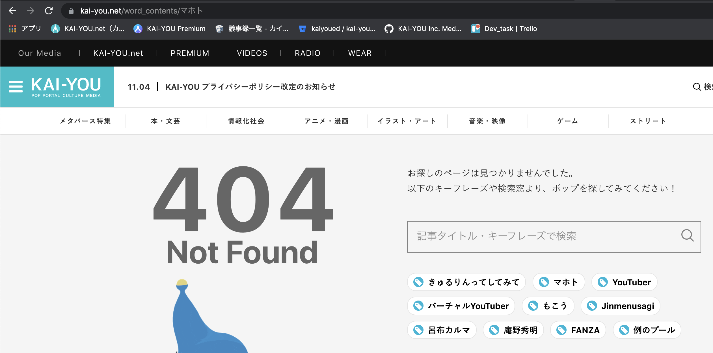

# 301リダイレクトによるSEO評価引継ぎ

## タスクの種類
既存ページの改善

## 課題
URL変更に伴って、新規ページが以前のページで得たSEO評価を引き継いでいない。

## 目的
- 以前使用していたURLを開いた際に、新規ページへの301リダイレクトによる遷移で以前獲得していたSEO評価を失わないようにする。

## 作業内容
- `/word_contents/***` を開いた際に404エラーではなく、301リダイレクトを実行

## 確認URL
[https://kai-you.net/word_contents/%E3%83%9E%E3%83%9B%E3%83%88](https://kai-you.net/word_contents/%E3%83%9E%E3%83%9B%E3%83%88)

## 該当箇所

---

## YWT

#### わかったこと
- [リダイレクトとGoogle検索](https://developers.google.com/search/docs/advanced/crawling/301-redirects?hl=ja)
