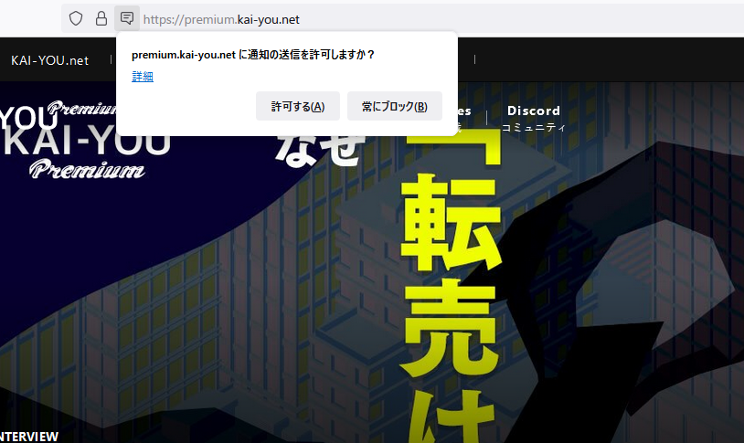
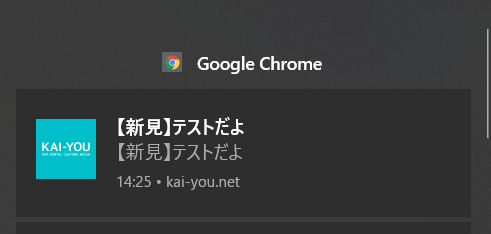
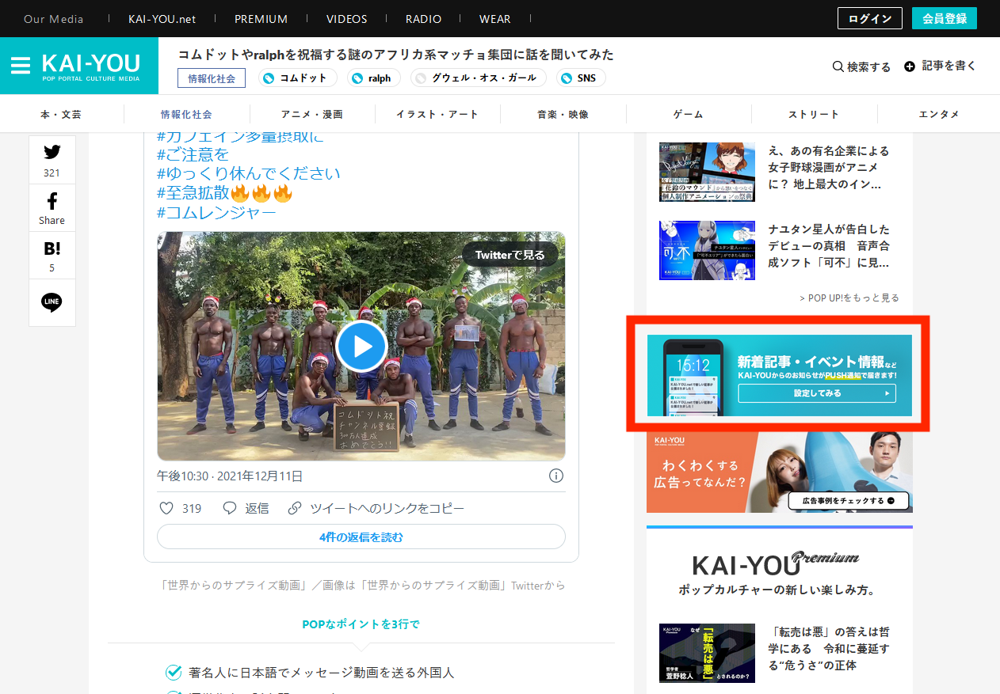
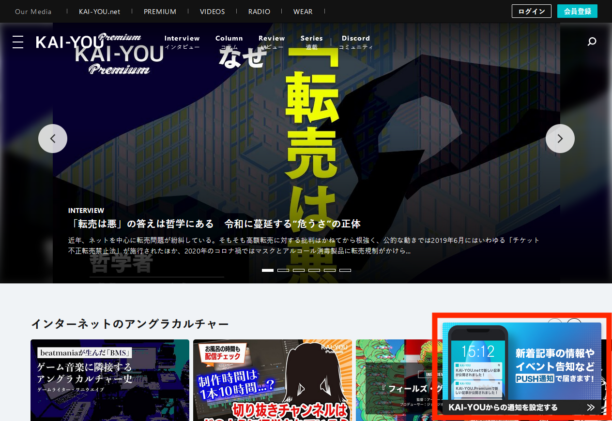

# ブラウザプッシュ通知機能の実装

## タスクの種類
新機能追加

## 課題
SNS以外に新着記事・コンテンツリリースをリアルタイムに訴求する手段が乏しい


## 目的
ユーザーの流入・反応増加


## 作業内容
KAI-YOU.net及びKAI-YOU Premiumへのプッシュ通知機能の実装


## 確認URL
Safariを除く主要ブラウザ環境（Microsoft Edge、Google Chrome、Mozilla Firefox）におけるKAI-YOU.net及びKAI-YOU Premium各ページ


## 該当箇所

Safariを除く主要ブラウザ環境（Microsoft Edge、Google Chrome、Mozilla Firefox）におけるKAI-YOU.net及びKAI-YOU Premium各ページ



---

## YWT

### やったこと・わかったこと

#### [Firebase Cloud Messaging](https://firebase.google.com/docs/cloud-messaging?hl=ja)（以下FCM）のWeb Push実装仕様について

今回の実装ではFCMのWeb Pushを利用した実装を行った。

##### 通知の種類
FCMの機能として用意されている通知は[大きく分けて2種類](https://firebase.google.com/docs/cloud-messaging/concept-options?hl=ja)が存在した。
- 通知メッセージ
  - 基本のメッセージ機能。
  - 通知リクエストを行う際には通知メッセージ向けに設定されたパラメータを用いてFCM API側がほとんど自動で通知を発行してくれる。
- データメッセージ
  - 通知リクエストの際にdataパラメータに各種データを設定して送信することで、クライアントアプリ側で制御の効くデータを送受信できる。
  - クライアントアプリ側で細かく通知の制御を行う場合はこちらを用いる。

今回はシンプルなプッシュ通知機能の実装だったため、通知メッセージを利用した。


##### 対応ブラウザ: Safariを除く主要ブラウザ環境（Microsoft Edge、Google Chrome、Mozilla Firefox)
対応ブラウザの中でも、Firefoxはページロードタイミングなど、こちらからの`Notification.requestPermission()`ができなかった。
厳密には実行はできるが、ポップアップのダイアログがブロックされ、`Notification.requestPermission().then(~`以降の動きが動作しなくなってしまっていた。

→ Firefoxではクリックイベント発生用に専用のバナーを掲出するように追加の実装を行った。




```
// User Agentごとの動作分岐
const userAgent = window.navigator.userAgent.toLowerCase();

if(userAgent.indexOf('msie') != -1 || userAgent.indexOf('trident') != -1) {
} else if(userAgent.indexOf('edge') != -1) {
    // トークンの作成と送信
    getAndSendToken();
} else if(userAgent.indexOf('chrome') != -1) {
    // トークンの作成と送信
    getAndSendToken();
} else if(userAgent.indexOf('safari') != -1) {
} else if(userAgent.indexOf('firefox') != -1) {
    // バナーはUser Agentを見て動的に差し替えを行う。
    bannerReplacement(getAndSendToken);
}
```

##### サブドメインの共通アプリサーバー運用環境での通知ドメイン切り分けについて
KAI-YOU.net及びKAI-YOU Premiumはドメインが違うものの同じアプリサーバー上で運用されているため、実装着手当初はルートディレクトリに設置するfirebase-messaging-sw.jsを共通のものにしていた。
この場合にユーザーが両ドメインの通知許可を出してトークンを発行していると、どちらか片方のドメインで発行されたトークンに向けて通知を送信しても両ドメインからそれぞれ通知が届いてしまっていた。

すなわち、ユーザーが通知許可を行ってトークンを発行したドメインが違っても、発行元のAPIキー・ブラウザが同じ場合、それぞれのドメインを発行元として通知が重複して届いてしまうことがわかった。

→ メインドメイン・サブドメインでサービスワーカー及びAPIキー周りの全てをFirebase Console上で別プロジェクトとして作り直し、実装を全て切り離した。


#### 受信設定について
先に述べたとおり、今回は通知メッセージを使用したため基本的にはAPI側が受信をおこなってくれるが、ユーザーがリアルタイム（フォアグラウンド）でアプリを訪問している場合は例外で、通知の受信はされるが表示が行われない。
そのため、通知メッセージを使う場合でもフォアグラウンドでは受信から表示を行う処理が必要となった。


```
/* APIのinitialize等は割愛 */

// フォアグラウンドでのプッシュ通知受信
onMessage(messaging, (payload) => {
    const notificationTitle = payload.notification.title; // タイトル
    const notificationOptions = {
        body: payload.notification.body,
        icon: 'example icon url',
    };

    // 通知許可されていたら通知する
    if (Notification.permission === "granted") {
        const notification = new Notification(notificationTitle, notificationOptions);

        // 通知クリックで開くURLを組み立てる
        const domain = window.location.protocol + "//" + window.location.hostname;
        const uri = domain + payload['data']['gcm.notification.url'];

        // クリックで新しいタブで開く
        notification.onclick = function(e) {
            e.preventDefault();
            window.open(uri, '_blank');
        }
    }
});
```