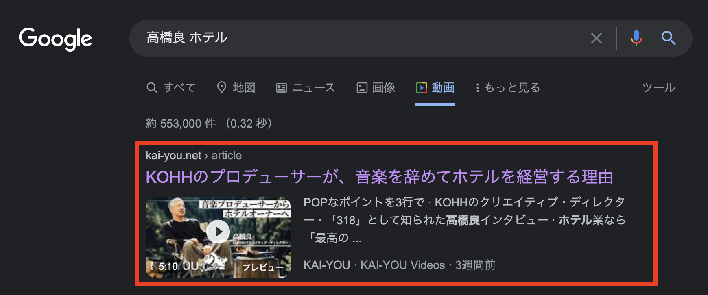

# 動画構造化データ追加

## タスクの種類

SEO改善

## 課題

検索からの流入を増やしたいが、現状、全ての記事が記事構造化データのみとなっているため、他サイトと差別化を図れていない。


## 目的

SEO改善によるPV数の増加


## 作業内容

アイキャッチでYouTubeの動画が使用されている記事に対して、動画構造化データを追加する


## 確認URL

- googleで動画記事を検索し、リッチリザルトコンテンツが表示されるか確認
    > [例として「kohh プロデューサー」で検索した結果](https://www.google.com/search?q=kohh+%E3%83%97%E3%83%AD%E3%83%87%E3%83%A5%E3%83%BC%E3%82%B5%E3%83%BC&source=lnms&tbm=vid&sa=X&ved=2ahUKEwiwgpOQz5z1AhXFw4sBHVIUDx4Q_AUoAnoECAIQBA&biw=1082&bih=716&dpr=2)
- https://search.google.com/test/rich-results?hl=ja で動画記事のURLをテスト


## 該当箇所



---

## YWT

### やったこと・わかったこと

動画構造化データを実装するにあたり、以下3点が重要なポイントだった。
1. [Google検索セントラル スキーマ マークアップを使用して Google に動画を表示させる](https://developers.google.com/search/docs/advanced/structured-data/video?hl=ja)を参考に実装する
2. 動画構造化データに動画投稿日とサムネイルが必要なため、[YouTubeDataApi](https://developers.google.com/youtube/v3/getting-started?hl=ja)から動画投稿情報を取得する
3. 既存の記事構造化データに追加するようなデータ構造にする


#### 動画構造化データの実装について

 以下のデータ構造で実装。

``` json
{
    "@type":"VideoObject",
    "name":"動画タイトル",
    "description":"動画の説明文（概要文）",
    "contentUrl":"該当の動画URL",
    "uploadDate":"動画投稿日（YYYY-MM-DD hh:mm:ss 形式）",
    "thumbnailUrl":"動画のサムネイル"
}
```

YouTubeDataApiから動画情報を取得するにあたり、以下の手順を行った。
1. [YouTubeDataApiの概要](https://developers.google.com/youtube/v3/getting-started?hl=ja)を参考に登録し、YouTubeDataApiのTokenを取得
2. Tokenを使って、curlでpostし動画情報を取得
    
    ※動画情報取得の際に該当の動画IDが必要

    ``` php
    ~~~

    $apiUrl = YOUTUBE_DATA_API_URL;
    $apiKey = YOUTUBE_DATA_API_KEY;

    $options = "&part=snippet";
    $url = $apiUrl . "videos?id=" . $videoId . "&key=" . $apiKey . $options;

    $decodedJson = $this->curlRequest($url);

    ~~~
    ```

3. 取得した動画情報をjson-ld用に整理する

    ``` php
    $publishedAt = DateTime::createFromFormat('Y-m-d\TH:i:s+', $youtubeData['items'][0]['snippet']['publishedAt']);
    $publishedAt->setTimezone(new DateTimeZone('Asia/Tokyo'));

    $videos = array(
    "videos" => array(
        "@type" => "VideoObject",
        "name" => $youtubeData['items'][0]['snippet']['title'],
        "description" => $youtubeData['items'][0]['snippet']['description'],
        "contentUrl" => 'https://www.youtube.com/watch?v=' . $youtubeData['items'][0]['id'],
        "uploadDate" => $publishedAt->format('Y-m-d h:i:s'),
        "thumbnailUrl" => $youtubeData['items'][0]['snippet']['thumbnails']['default']['url'],
    );
    ```

4. 整理したデータを既存のjson-ldに追加する

    全体として1つの構造化データのまとまりであり、動画は記事の動画だということをGoogleに理解していただく必要がある。
    そのため、json-ldは複数作らず、1つのjson-ldに集約する。

    ``` php
    $json = array (
    "@context" =>  "https://schema.org",
    "@type" =>  $type,
    "url" =>  $contentUrl
    ~~~~~
    );

    $json = $json + $videos;
    ```
