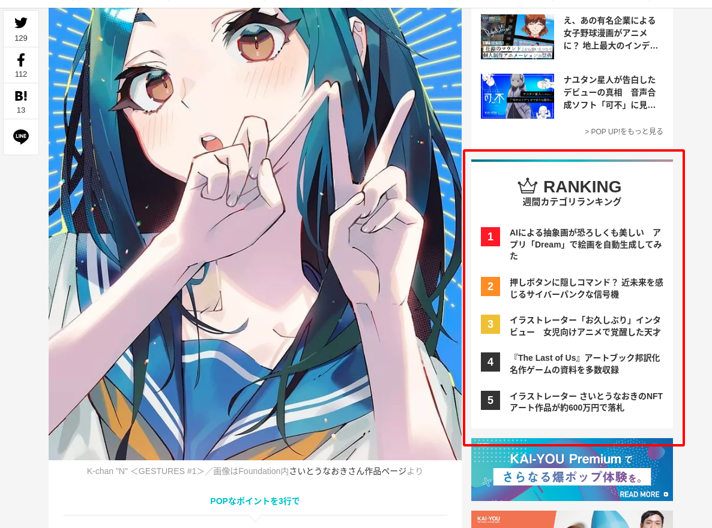
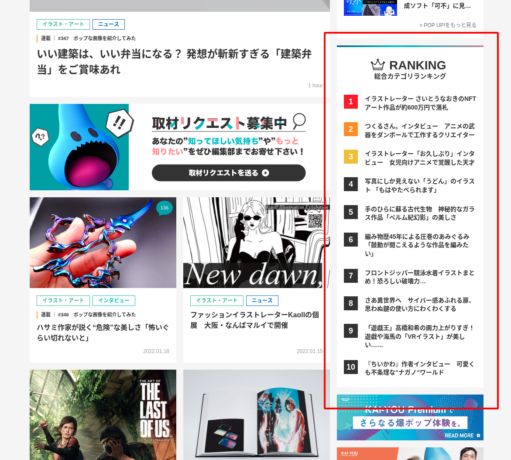
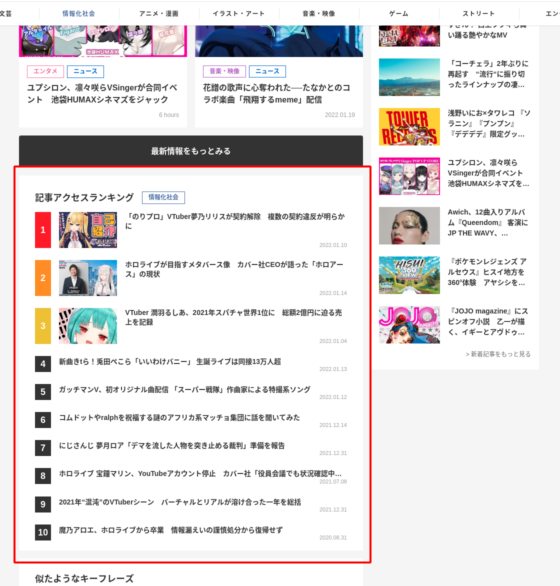

# カテゴリー記事ランキングの追加（週間ランキング・総合ランキング）

## タスクの種類

SEO改善

## 課題

- [記事詳細ページ](https://kai-you.net/article/81749)
- [カテゴリTOPページ](https://kai-you.net/category/art)
- [キーフレーズ詳細ページ](https://kai-you.net/word/%E3%83%90%E3%83%BC%E3%83%81%E3%83%A3%E3%83%ABYouTuber)

上記ページの内部リンクが少ないのでGoogleBotのクローラビリティが低い

## 目的

クローラビリティ改善によるSEO評価改善

## 作業内容

新たに、GoogleAnalyticsAPIをつかって各カテゴリーごとの週間ランキング・総合ランキングを作成。

[キーフレーズ詳細ページ](https://kai-you.net/word/%E3%83%90%E3%83%BC%E3%83%81%E3%83%A3%E3%83%ABYouTuber),[記事詳細ページ](https://kai-you.net/article/81749),[カテゴリTOPページ](https://kai-you.net/category/art)の各ページに同カテゴリーの記事アクセスランキングを設置する。

## 確認URL

- [記事詳細ページ](https://kai-you.net/article/81749)
- [カテゴリTOPページ](https://kai-you.net/category/art)
- [キーフレーズ詳細ページ](https://kai-you.net/word/%E3%83%90%E3%83%BC%E3%83%81%E3%83%A3%E3%83%ABYouTuber)

## 該当箇所

- 
- 
- 

---

## YWT

### やったこと・わかったこと

GoogleAnalyticsAPIの集計期間を長くしてもデータ取得に関しての取得時間はあまり変わらない。

