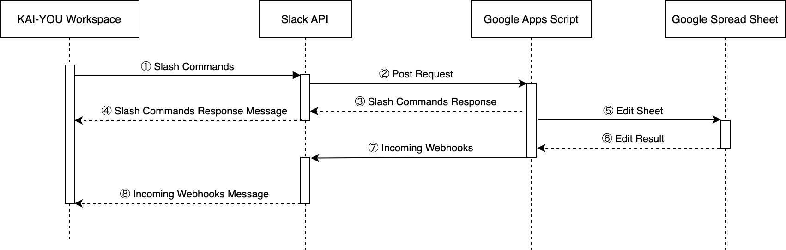
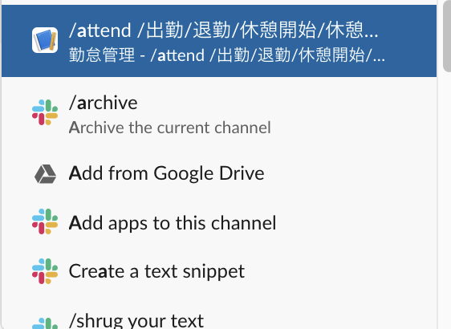
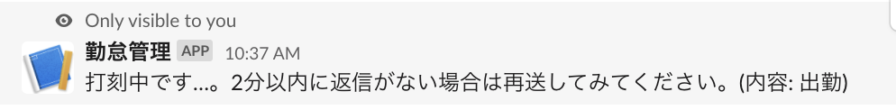
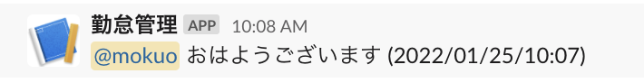

# Slack勤怠管理botの実装

## タスクの種類

新機能追加

## 課題

従来のKAI-YOUの勤怠管理の不便さ


## 目的

業務効率改善


## 作業内容

Google Apps ScriptおよびSlack APIを利用したSlack上で勤怠打刻ができるbotの実装


## 該当箇所

KAI-YOU業務用のSlack Workspace

## YWT

### 利用したもの

#### [Slack API](https://api.slack.com/)
- [Slash Commands](https://api.slack.com/interactivity/slash-commands)
- [Incoming Webhook](https://api.slack.com/messaging/webhooks)
Slash Commandsから実行するBotの応答期限が3秒と非常に短く、応答期限内の処理が間に合わないため、今回はSlash CommandsとIncoming Webhookの合わせ技で実装した。

#### [Google Apps Script](https://workspace.google.co.jp/intl/ja/products/apps-script/)

Slack API側からリクエストを受け、Slash Commands実行時のレスポンス送信、スプレッドシートへの記録、Slack APIのIncoming Webhookを利用した打刻結果の返信など、勤怠Botの機能全般を担う。

#### Google スプレッドシート

主に打刻データの記録・管理に利用。
Apps Scriptの動作設定ファイルとしても利用。
打刻シートをそのまま勤怠管理表として利用できるように。

### やったこと・わかったこと

主な処理の流れを以下の図のように実装した。


#### ① ② コマンドの実行
KAI-YOUのワークスペース上に「`/attend`」というコマンドを設定し、「`/attend 出勤`」のように、打刻したい内容を追加して実行。



実行すると、Apps Scriptで実装されたBotへのリクエストが行われる。

#### ③ ④ Botからの応答メッセージ
先述の通り、Botからの応答期限が3秒と短いため、すぐにSlack APIへと応答を返す。



#### ⑤ ⑥ Google スプレッドシートへの記入
メッセージ送信者のSlack IDに合わせたシートの作成・記入を行う。

#### ⑦ ⑧ 打刻完了のメッセージ返信
シート記入後、Slack Incoming Webhooksを利用して打刻完了のメッセージを返信する。




#### Google Apps Scriptを用いたスプレッドシート、カレンダーの操作
今回の実装では、Googleカレンダーから年間の祝日の取得を行い、弊社定休日に合わせた設定を入れたシートを生成するような処理を実装した。

特定の日付の祝日を取得する処理

```javascript
const date = new Date();
const id = 'ja.japanese#holiday@group.v.calendar.google.com'
const cal = CalendarApp.getCalendarById(id);
const events = cal.getEventsForDay(date);

return events;
```

簡単なスプレッドシートの操作

```javascript
// スプレッドシートの作成（Apps Scriptを設置している階層と同じところに作成される）
const newSS = SpreadsheetApp.create(fileName);

// スプレッドシートを開く
const spreadsheet = SpreadsheetApp.openById(newSS.getId());

// スプレッドシート内の特定のシートを開く
const sheet = spreadsheet.getSheetByName(sheetName);

// A1~Q1のシートのデータ取得
const values = sheet.getRange("A1:Q1").getValues();

// A1からB2へのシートデータ挿入
sheet.getRange('A1:B2').setValues([['A1', 'B1'], ['A2', 'B2']]);
```

#### Slash Commands への応答
Slash CommandsからはPostリクエストが行われるため、Apps Script側でもPostを受け取る処理を実装

```javascript
function doPost(e) {
  // Slackのusername、コマンドと同時入力されたテキストなどがパラメータとして送られてくる
  const name = String(e.parameters.user_name);
  const text = String(e.parameters.text);

  // 打刻予約（後述）
  reserveAttend(name, text);

  // Slash Commandsへのレスポンスを組み立てて返す
  const output = ContentService.createTextOutput();
  output.setMimeType(ContentService.MimeType.JSON);
  output.setContent(JSON.stringify({
    'text': `打刻中です…。2分以内に返信がない場合は再送してみてください。(内容: ${text})`
  }));

  return output;
}
```


#### 打刻予約
Slash Commandsへの応答をスムーズにするため、Slash Commandsからのリクエストの際にはキャッシュに打刻情報を記録する処理のみを行い、定期実行のトリガーにて打刻の処理を行うように実装した。

```javascript
// キャッシュの保存処理
function reserveAttend(username, text){
  // 実行時間を送信時間として記録
  const requestTime = get_dateTime();

  // 新規打刻データ
  const newReserve = {
    "username": username,
    "text": text,
    "date": requestTime,
  }

  // キャッシュから予約中データを取得して追加
  const cache = CacheService.getScriptCache();
  const cacheData = cache.get("attend");

  let reserveAttends = '';
  // 今回はカンマ区切りで実装
  if(cacheData !== null){
    reserveAttends = cacheData + ',' + JSON.stringify(newReserve);
  } else {
    reserveAttends = JSON.stringify(newReserve);
  }

  // キャッシュを保存
  cache.put("attend", reserveAttends, 60*60);

  return;
}
```


#### Slack Incoming Webhookでのメッセージ送信
先述の通り、Slash Commandsの応答期限が厳しいため利用

Apps Scriptには事前に`UrlFetchApp`クラスが用意されている
```javascript
function messageSend(text) {
  const options = {
    'method' : 'post',
    'contentType' : 'application/json',
    'payload' : JSON.stringify({
      'text' : text
    })
  };

  return UrlFetchApp.fetch(SLACK_WEBHOOK_URL, options);
}
```
