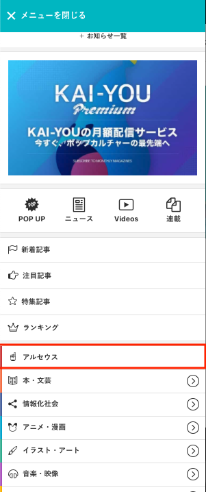

​
​
# フックアップカテゴリーの実装
​
## タスクの種類
​
新機能追加
​
## 課題
​
既存のカテゴリと同じ並びで特定ワードを含んだ記事をまとめ、
新規カテゴリページ（フックアップカテゴリー）として表示したい
​
​
## 目的
​
SEO改善
​
​
## 作業内容
​
管理画面で検索ワード・URL・メニュー内への表示期間などを設定できるようにし、
設定された検索ワードで記事一覧を表示できるようにする。
​
​
## 該当箇所
​
* KAI-YOU.netのメガメニュー



* KAI-YOU.netのメニュー


* フックアップカテゴリページ


​
## YWT
​
### やったこと・わかったこと
​
1. 設定したURLで表示できるようにroutingする
2. 設定したURLを開いたときに、設定した検索ワードで検索結果ページを表示する
3. 設定したURLでcanonicalを設定する
4. 設定したワードでフックアップカテゴリー名を表示する
​
#### CakePHP コントローラー内で別モデルを使う場合
​
コントローラー内で別モデルを使用する場合に、記述の方法が変わる。
​
下記のように、`$this->paginate` 内では `conditions` を使用してもHookupCategoriesModelが参照されてしまうので、
`$this->Paginator->paginate` を呼び出し、
モデル名とコンディションを設定すると正しく別モデルとのやり取りができるようになる。
​
```php:HookupCategoryController.php
​
$conditions = array(
    'Content.keyphrase LIKE' => '%設定するフックアップカテゴリー%',
);
$this->paginate = array(
    'Content' => array(
        'order' => 'published DESC',
        'limit' => 15,
    )
);
$contents = $this->Paginator->paginate(
    'Content', $conditions
);

```
