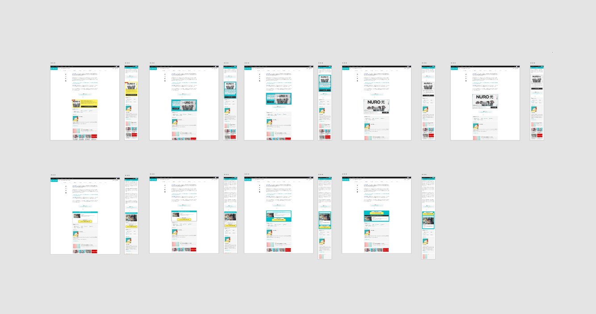
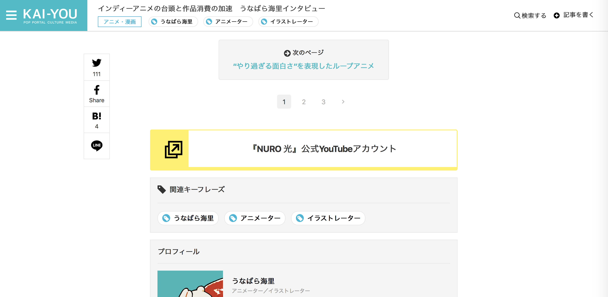
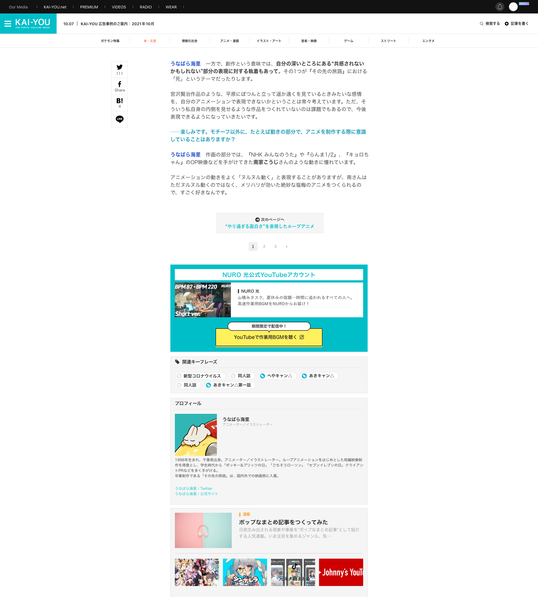
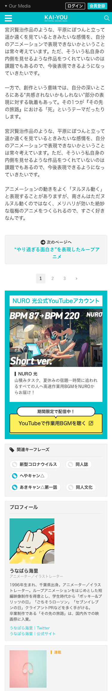

# POP UP！スペシャルリンクのCTR改善

## タスクの種類

既存ページの改善

## 課題

記事に紐づいた関連情報のクリック率（CTR）を改善したい

## 目的
- 記事広告のCTRをより向上させたい
- 記事を読んで興味を持っていただいたユーザーに対しての案内を分かりやすくしたい

## 作業内容

#### ページャー下でも目立ち、クリックorタップしてみたくなるようなUIに見た目そのものをリニューアル
- リンクをよりボタンらしいデザインに
- リンクタイトルだけでなく、補足テキストを追加することでジャンプ先をイメージしやすいように
- 近年のスマホユーザー増加傾向を意識して重要な情報が上から順に並ぶようにレイアウト
- 複数のパターンを作成し、比較・検討

## 確認URL

[https://kai-you.net/article/82383](https://kai-you.net/article/82383)

## 変更前デザイン

## 変更後デザイン

