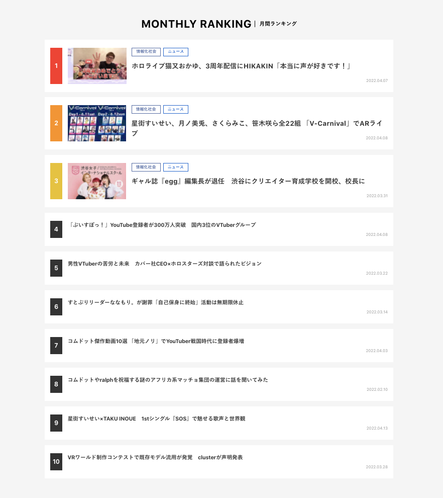

# 総合ランキングの撤廃・カテゴリ別月間PVランキングの実装

## タスクの種類

SEO施策

## 課題

変動が少ない総合ランキングを記事ページ下に設置しているため、全記事に同一コンテンツが表示されている。


## 目的

変動の少ない総合ランキングを記事ページ下から削除し、カテゴリ別の月間PVランキングに変更する。


## 作業内容

#### 集計方法

GoogleAnalyticsAPIを使用し、期間を1ヶ月間で取得。

実装は以下である。

期間は現在から1ヶ月前とし、
PV数を対象とする `ga:pageviews` を指定、
`max-results` に最大レスポンス行10000を設定した。

以下の実装を各カテゴリ（音楽やゲームといったジャンル）別に絞ってコマンドを定期実行する作りとした。

```php
// 期間指定
$from = date('Y-m-d', strtotime('-1 month'));
$to   = date('Y-m-d');

$metrics = "ga:pageviews";
$options  = array(
    "dimensions" => "ga:pageTitle, ga:pagePath",
    "max-results" => 10000,
    "sort" => '-ga:pageviews',
);

// データの取得
$ga = $analytics->data_ga->get(ANALYTICS_VIEW_ID, $from, $to, $metrics, $options);
```

 


## 確認URL

- [記事詳細ページ](https://kai-you.net/article/81749)

---
