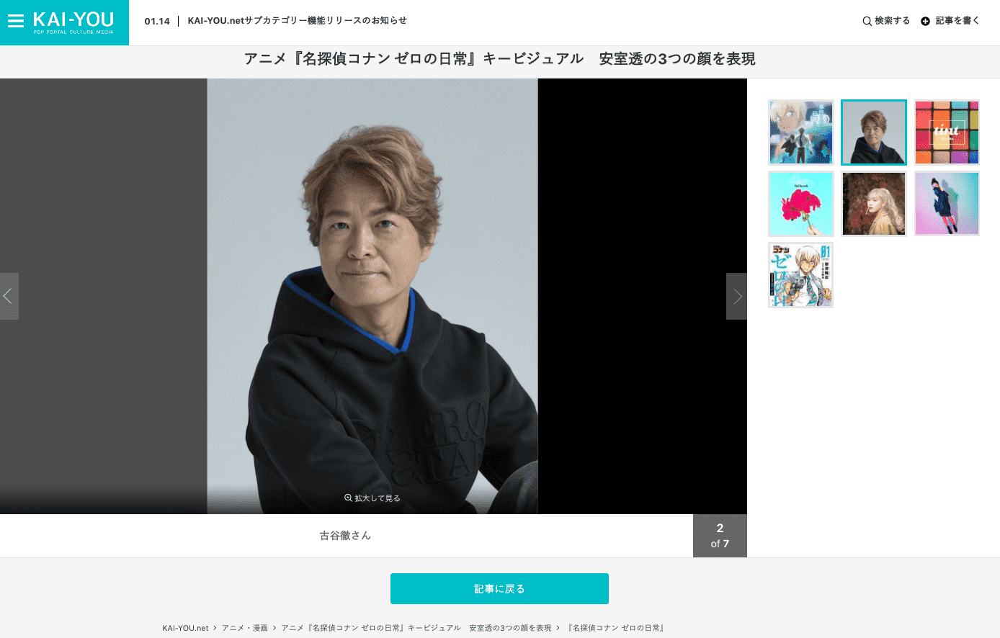
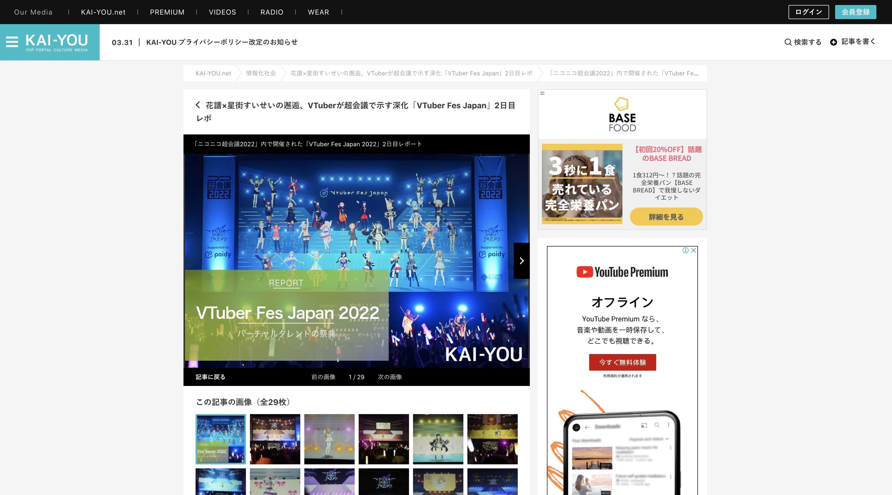
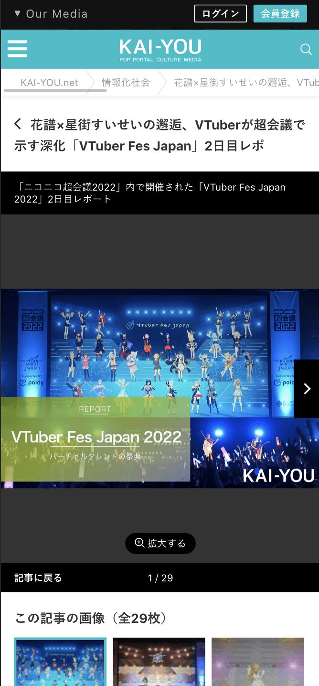

# 画像ページの改修（CLS対策）

## タスクの種類
既存ページの改善

## 課題
画像ページで検出されている[CLS](https://web.dev/cls/)の数値改善

## 目的
- CLSの数値を改善することでWebページとしての評価を高めたい
- Swiperの高さが表示する画像に左右されないようにすることで、常に同じ体験を提供できるようにしたい

## 作業内容
#### 画像のサイズに依存しないSwiperの設定
- KAI-YOU.netのデザインルールに則った2カラムの横幅設定に
- ページ枚数（現在地）をSwiper中央に配置することで、情報を探さずとも自然に確認できるように
- 「画像を拡大」ボタンを目に入りやすい位置（ページ枚数周辺）と見た目にすることでデフォルトのサイズを小さくできるように
- 表示する画像によって見やすさに差が出来ないよう、画像の上に情報を載せるのは極力避けた。その上でボタンやテキスト情報には背景に黒帯を設定した
- 画像を見に来たユーザーが余計なスクロールをすることなく目的が達成できるように「記事に戻る」ボタンもSwiper内に収めた
- モバイルファーストを意識して、画像一覧を全サイズ共通でSwiper下に表示するように

## 確認URL
[画像ページ](https://kai-you.net/article/83554/images/1)

## 変更前デザイン

## 変更後デザイン

