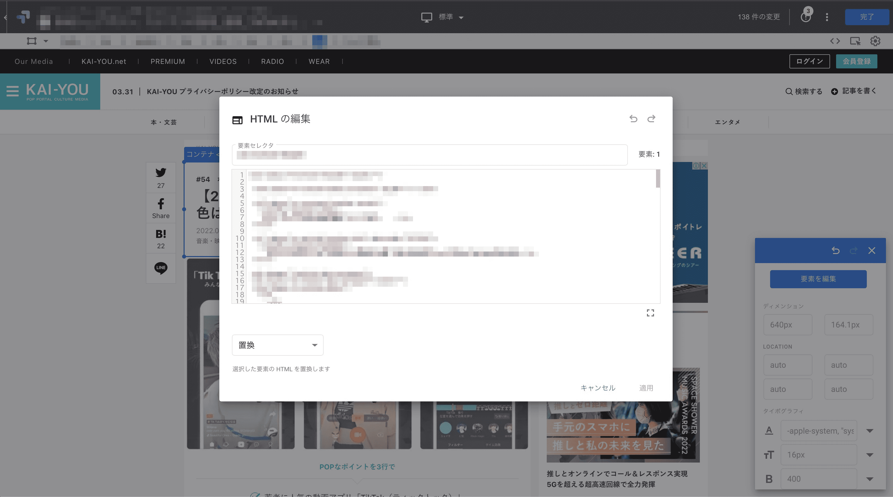
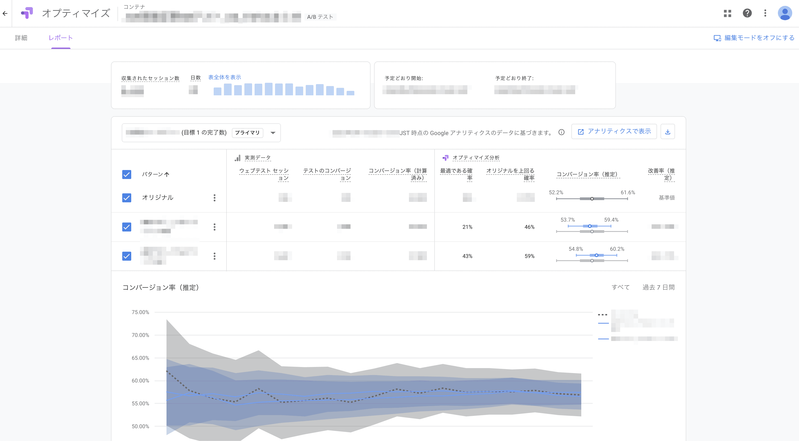
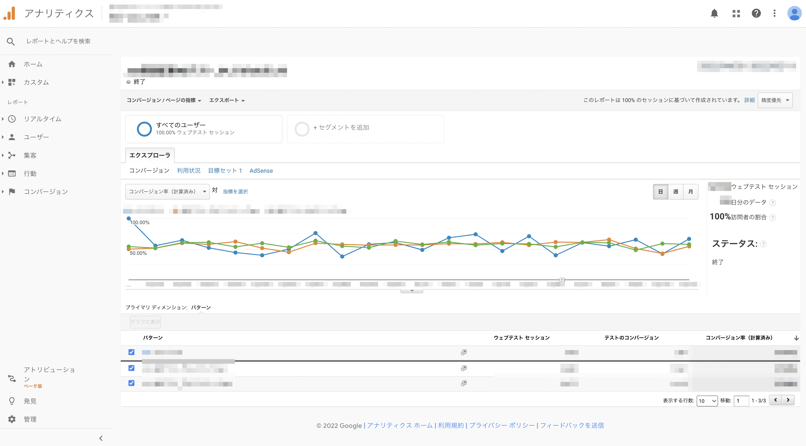

# Google Optimizeを使用してのABテスト

## タスクの種類
既存ページの改善

## 課題
１ユーザーあたりのページ/セッション数を増加させるため、記事末尾に入っている関連記事のコンバージョン率を向上させたい

## 目的
- ページ/セッション数を増やすことでより多くの記事にアクセスしてもらいたい
- 記事を読んで興味を持ってもらった状態からすぐ次の情報にアクセスできるようにすることでUXを向上させたい

## [Google Optimize](https://marketingplatform.google.com/intl/ja/about/optimize/)を採用した理由
- Googleアナリティクスと連携が可能で、数値の確認が行いやすい
- 表示条件やユーザー層（デバイスごとなど）が細かく設定できる
- htmlやcssなど簡単な要素の入れ替えがOptimize上で編集可能　など

## 作業内容
#### エクスペリエンスを作成
- 名前とテストしたいページ、テストのタイプを選択

#### テストパターンやテストを表示するユーザー、測定や目標となる数値の設定
- パターンを生成し、Optimize上で編集していきます。編集した情報はオプティマイズ スニペットをサイトに追加することでプレビューから確認できるようになります

#### 編集と確認が終わったら期限を設定しテストを開始
- テスト結果はレポートとしてOptimizeやアナリティクスからも確認が可能

## YMT
- cssの編集、クラスの指定に関して独特な癖があった。hover要素や打ち消さないといけない要素もいくつか出てくるが編集できる行数に限界があるので可能なだけ記述をコンパクトに
- コンテナ単位でマウスクリックしながら位置の入れ替えが出来るのだが、その場合はcssがクラス名での指定ではなくdiv:nth-of-typeのような表記に全て差し変わるので注意したい
