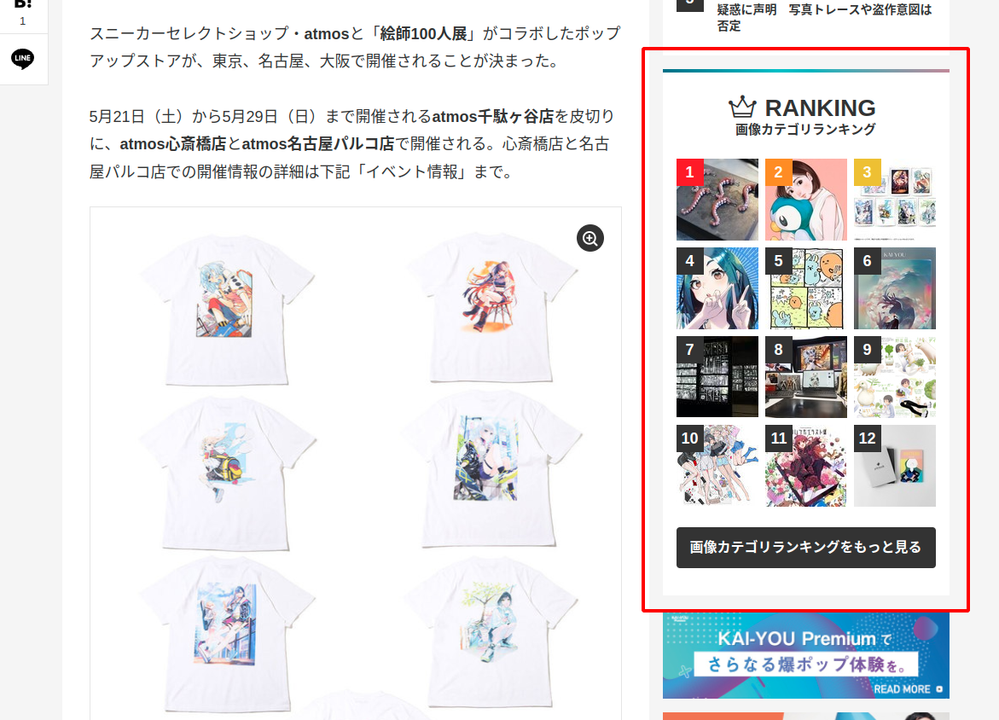
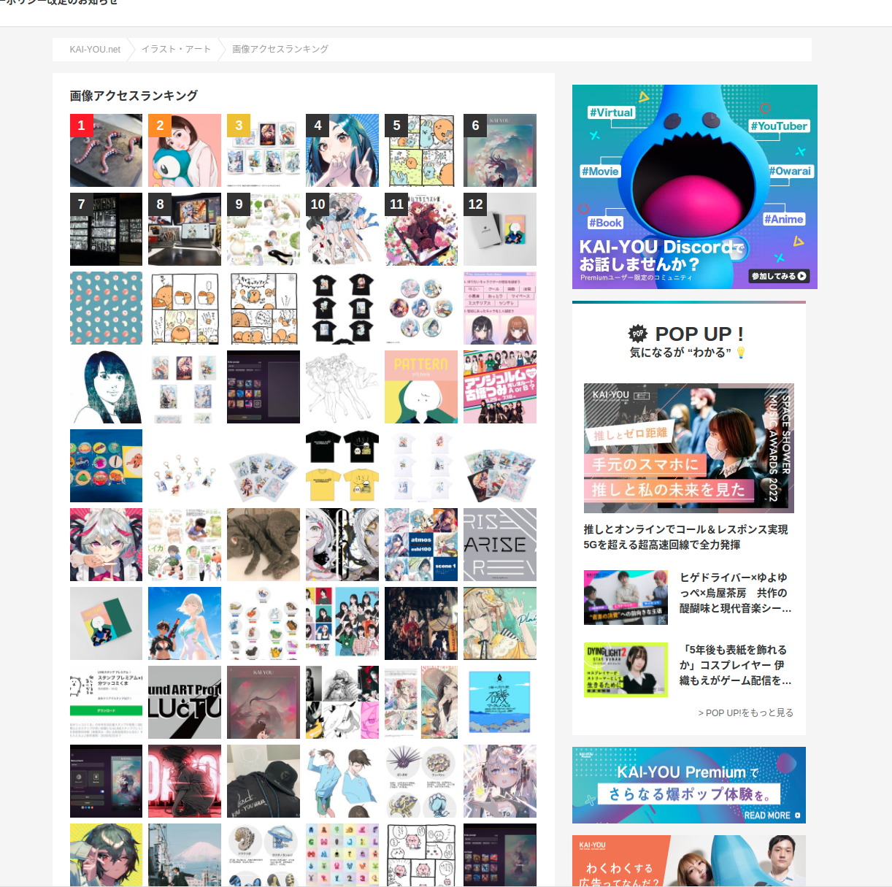
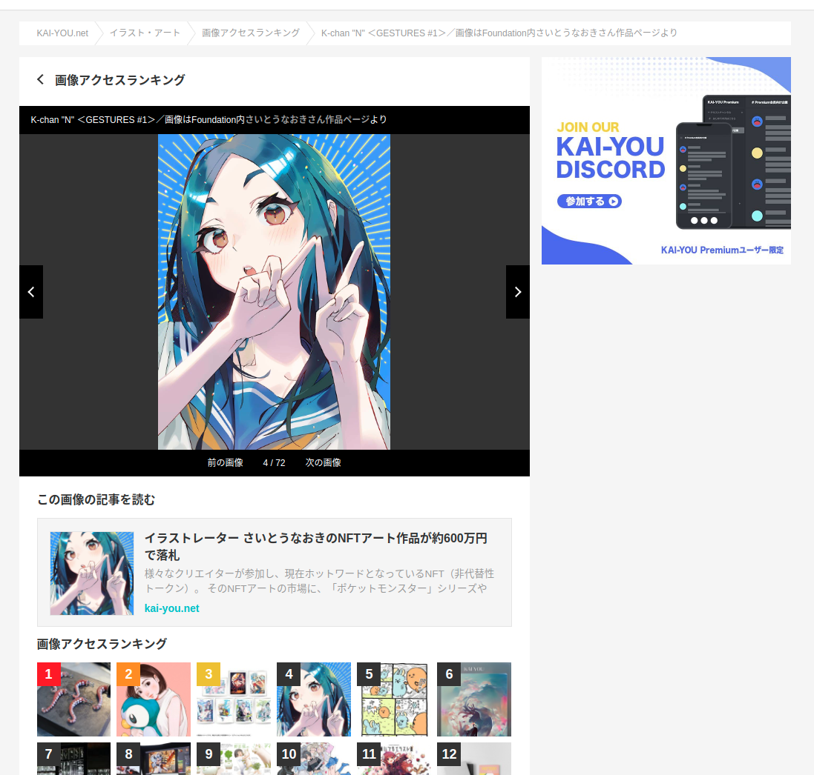

# 画像カテゴリランキングの作成

## タスクの種類

SEO施策

---

### 課題

画像ページをインデックスするようにしたものの、各記事からのみリンクが貼られている状況でクローラビリティが悪い。


## 目的

各記事に各カテゴリーの画像アクセスランキングを設置し、クローラビリティ改善・画像ページの評価向上。


### 作業内容

- 記事の画像ページへのアクセスが多いページを各カテゴリーごとにまとめてランキングを取得するスクリプトの作成。
- 記事ページ、キーフレーズページ、カテゴリーページのサイドバーに設置。
- 各カテゴリーごとのランキング一覧ページ、その画像の詳細ページを作成する。


#### 作業上の注意

・ランキングからの画像の詳細ページのcanonicalは元々の記事からの画像ページへ向ける

```
https://kai-you.net/category/information-society/images/1 のcanonicalは
https://kai-you.net/article/83602/images/1 に向ける
```


### 確認URL

[https://kai-you.net/category/information-society/images](https://kai-you.net/category/information-society/images)
[https://kai-you.net/category/information-society/images/1](https://kai-you.net/category/information-society/images/1)


## 該当箇所

- 記事ページサイドバー


- 画像アクセスランキングページ


- 画像アクセスランキング個別ページ

