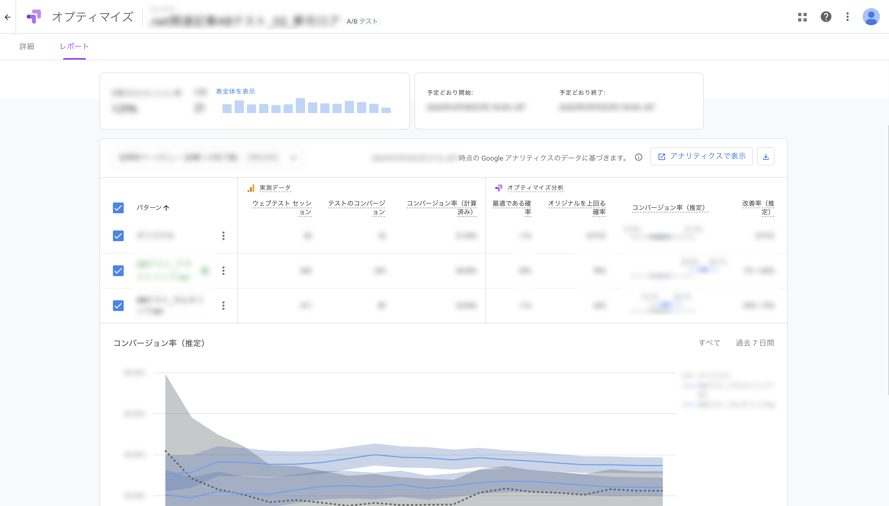

# ABテストの結果を踏まえたUI改修について
## タスクの種類
既存ページの改善

## 目的
- 関連記事をよりユーザーの目に止まるようにし、回遊率の向上をはかりたい

## サムネ付きかテキストリンクのみかを検証
- 他社サービスとの比較や傾向の調査を実施
- モバイルファーストを意識したデザインを


### 実装
テストを行う上でGoogle Optimizeにやってもらう出し分け処理が2点。
- PC, mobileでの拡大鏡アイコンの削除
- 画像のリンク削除

optimize上でCSS, javascriptを動かすことができるため、上記2点はGoogle Optimize上で設定する。
#### CSS（optimize上では下記HTMLをheadタグ末尾に追加した）
```html
<style type="text/css" data-test="TEST">
@media screen and (max-width: 1080px) {
.l-article-eyecatch .m-article-eyecatch a.m-article-eyecatch-link::before{
  content: none;
}
.m-article-text-main div.caption figure.figure a::before {
  content: none;
}
.m-article-text-main figure.figure a::before {
  content: none;
}
}
</style>
```
#### javascript
```
window.onload = function(){
  if (window.matchMedia && window.matchMedia('(max-device-width: 1080px)').matches) {
   const eyecatchLink = document.querySelector('a.m-article-eyecatch-link');
   eyecatchLink.removeAttribute('href');
   const mainContent = document.querySelector('div.m-article-text-main');
   const imgLinks = mainContent.querySelectorAll(':scope figure.figure a');
   imgLinks.forEach((link) => {
     link.removeAttribute('href');
   });
  }
}
```
## パターンを選定してABテストを実施


#### ABテストで本番反映する方針が決まったのでさらにクリック率が上がらないか再検証
- フォントサイズやbold等の最適を探るために再度Google Optimizeでテスト
- 検証結果を元に本番反映するパターンを決定


## YMT
- Google Optimizeで複数回テストを行った
