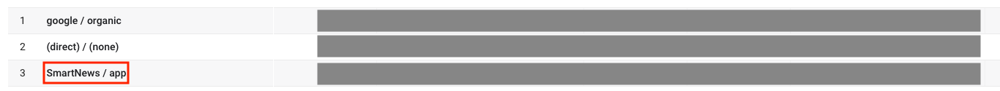

# スマートニュースのGA4対応

## タスクの種類

GA4対応

## 課題
- スマートニュースでのPVがGA4で計上されていない

## 目的
スマートニュースでのPVをGA4で計上する

### 作業内容

- サイトで出力しているxmlにスマートニュース側から指定されている実装を組み込む

スマートニュース側のヘルプに以下の指定がされている。


>### 既存のGA(UA)とGA4を同時に使用する場合
>
>GA4のID が、G-XXXXXXXX、UAのIDがUA-YYYYYYYY-Z、ページビューの対象となる記事のURLが、https://exsample.com/news/12345 だった場合
>```
><snf:analytics ><![CDATA[
>    <script async src="https://www.googletagmanager.com/gtag/js?id=G-XXXXXXXX"></script>
>    <script>
>        window.dataLayer = window.dataLayer || [];
>        function gtag(){dataLayer.push(arguments);}
>        gtag('js', new Date());
>
>
>        gtag('config', 'G-XXXXXXXX',{
>            'page_path':'/news/12345',
>            'page_referrer':'http://www.smartnews.com/',
>            'campaign_source':'SmartNews',
>            'campaign_medium':'app'
>        });
>        gtag('config', 'UA-YYYYYYYY-Z',{
>            'page_path':'/news/12345',
>            'page_referrer':'http://www.smartnews.com/'
>        });
></script >
>    ]]></snf:analytics>
>```

上記の実装を施した。

結果的に、GA4側で `SmartNews / App` として計上されていることが確認できた。

## GA4計上時の表示



## 参考URL
#### [Google Analytics 4には対応していますか？](https://publishers.smartnews.com/hc/ja/articles/6944692770841-Google-Analytics-4%E3%81%AB%E3%81%AF%E5%AF%BE%E5%BF%9C%E3%81%97%E3%81%A6%E3%81%84%E3%81%BE%E3%81%99%E3%81%8B-)
