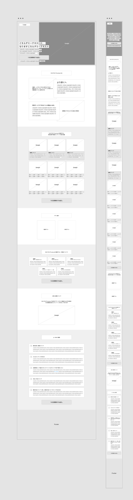
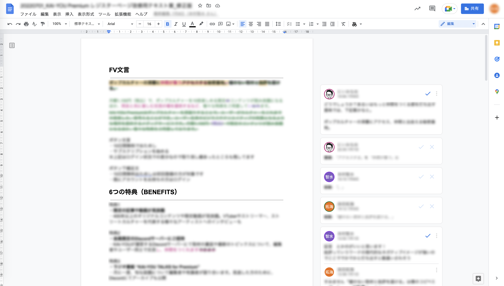
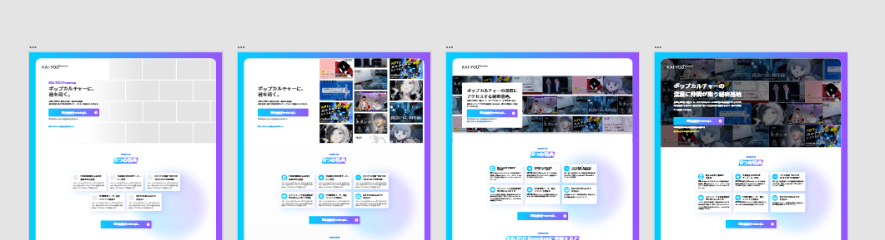
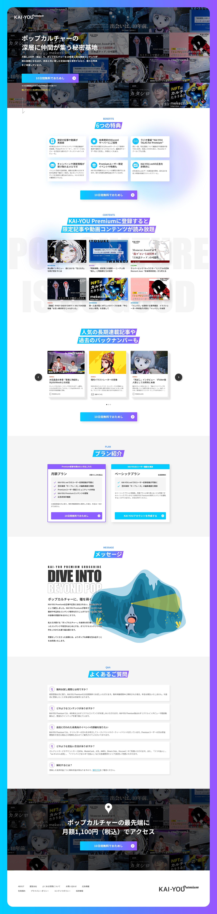

# KAI-YOU Premium レジスターページの改修について
## タスクの種類
[既存ページ](https://premium.kai-you.net/register)の改善

## 目的
- KAI-YOU Premiumがなぜ有料サービスなのか、ユーザーから直接いただいたお金をどのようなことに使えているのかお伝えしたい
- 既存のデザインや紹介テキストだとどのようなメリットがあるのか一目で分からなかったので、より分かりやすく簡潔なものにしたい
- プラン選択やコンテンツ紹介、よくある質問等をサービスの入り口で充実させることで安心して登録していただけるような体験を

## ワイヤーフレームを作成
- 上記を満たすために記事や連載情報、よくある質問など既存のページになかった要素を追加
ユーザーに知ってもらいたい情報や、我々が伝えたい情報の優先度などをプロジェクトメンバー内で検討し並び替えを行った
- コンテンツの個数など、他サブスクメディアの事例を参考に再設定
PCやタブレット、スマートフォンなど様々なデバイスから閲覧する際に情報として多すぎず、かつユーザーに知れて良かったと思われる量を目指して調整を行った

## 各種テキストもリライト
- 新しく追加した要素だけでなく、既存のテキストに関してもより簡潔にしつつ伝えたい情報を込められるようディレクターやPMと協力しつつ修正を行った
- KAI-YOU Premiumの役割として、ポップなコンテンツに触れられるだけなく、同じ興味を持ったユーザーと出会ったり交流したりすることができる環境を用意していることについても追記を行った

## 要素とテキストを固めて、デザインに肉付けを
- 確定したワイヤーフレームとテキストを元に、デザインに肉付けを
- 紹介する記事や使用するイラスト素材についても新しく作成し配置していく
- FVの見え方について、実装する動きを想像しながら微調整を重ねる

## YMT
- テキストやデザインの全体的な改修を行った 
