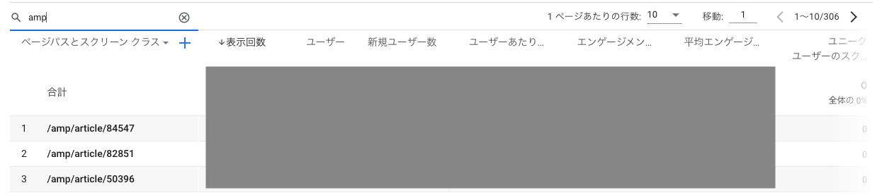

# GoogleAnalytics4のAMP対応（非公式）

## タスクの種類

GA4のAMP対応（非公式）

## 課題
- GA4でAMPページのPVなどが計上されていない（GA4がAMPのサポート対象外）

## 目的
AMPページのPVなどをGA4で計上する

### 作業内容

- AMPページにGA4で計測できるトラッキング設定を組み込む

GA4ではAMPページの計測はサポート対象外となっている。

しかし、非公式での計測方法があるため、そちらのトラッキング設定を組み込み、GA4でPVなどを計上できるようにする。


>### GA4でAMPページを計測するトラッキング設定
>
>```
><amp-analytics type="googleanalytics" config="https://amp.analytics-debugger.com/ga4.json" data-credentials="include">
><script type="application/json">
>{
>    "vars": {
>                "GA4_MEASUREMENT_ID": "G-XXXXXXXX",
>                "GA4_ENDPOINT_HOSTNAME": "www.google-analytics.com",
>                "DEFAULT_PAGEVIEW_ENABLED": true,
>                "GOOGLE_CONSENT_ENABLED": false,
>                "WEBVITALS_TRACKING": false,
>                "PERFORMANCE_TIMING_TRACKING": false,
>                "SEND_DOUBLECLICK_BEACON": false
>    }
>}
></script>
></amp-analytics>
>```

上記の実装を施した。

既存の実装に
```
<amp-analytics type="googleanalytics" id="pageView">
    <script type="application/json">
    {
      "vars": {
        "account": "UA-XXXXXXX-X"
      },
      "triggers": {
        "trackPageview": {
          "on": "visible",
          "request": "pageview"
        }
      }
    }
    </script>
    </amp-analytics>
```

のようなUAでのAMP設定が残っていた場合は、既存設定の下部にGA4でのトラッキング設定を追記すれば問題ない。

結果的に、GA4側で `AMPページ` が計上されていることが確認できた。

## GA4計上時の表示



## 参考URL
#### [GA4はAMPを依然として未サポート（非公式の計測方法あり）](https://www.suzukikenichi.com/blog/unofficial-method-to-measure-amp-with-ga4/)
