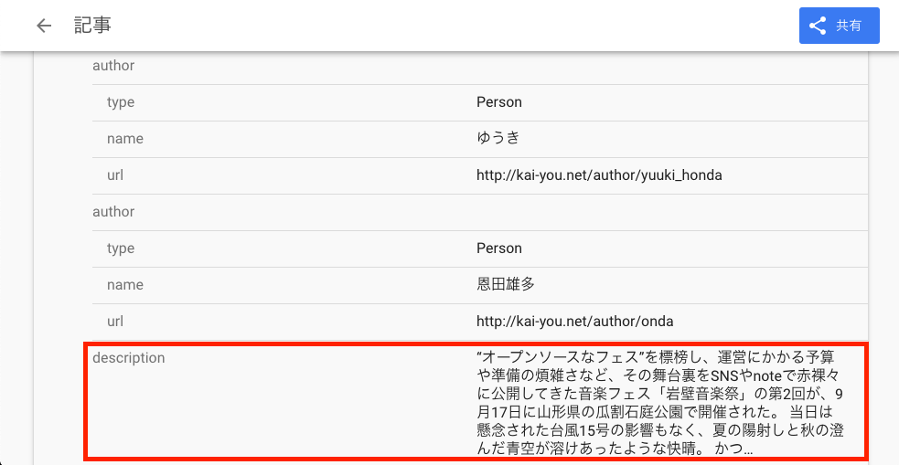

# 記事構造化データ プロパティ追加

## タスクの種類

SEO改善

## 課題

検索からの流入を増やすために、現状の記事構造化データに新しいプロパティを追加する。


## 目的

SEO改善によるPV数の増加


## 作業内容

記事ページ中の記事構造化データにdescriptionプロパティを追加する


## 確認URL

- https://search.google.com/test/rich-results?hl=ja で記事ページのURLをテスト


## 追加結果



---

## YWT

### やったこと・わかったこと

記事構造化データを実装するにあたり、以下を参考にした。
- [記事構造化データのdocs](https://schema.org/Article)

上記ドキュメントから分かる通り、記事構造化データは複数のプロパティが存在しているため、指定方法を誤らないように注意する。

リッチリザルトテストを用いて、実装したld+jsonをコードテストにリクエストすることで、構造化データに問題がないかを確認できる（URLによるテストも可能）。


### 記事構造化データの実装について

 以下のデータ構造で実装。

``` json
{
    "@context" : "https://schema.org",
    "@type" : "Article",
    "url" : "https://kai-you.net/article/*****",
    "headline" : "記事タイトル",
    "description" : "記事の要約", // 今回の追加箇所
}
```
