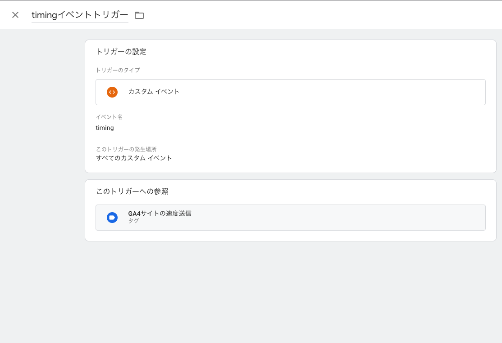
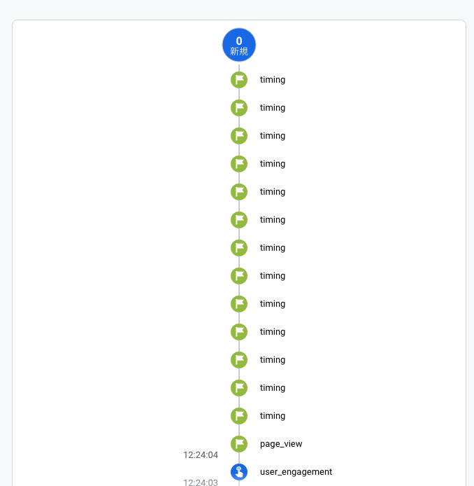

# 記事構造化データ プロパティ追加

## タスクの種類

問題周知・注意喚起

## 発生した問題

Google AnalyticsのUAで測定出来ていたサイト速度計測をGA4で再現しようとしたところ、PVイベントが複数発生した

## 作業内容

UAで測定出来ていたサイト速度計測をGA4で再現する。

GoogleTagManagerを使用し、以下のタグとトリガーを設定した。

※設定方法は [[GA4] Google Analytics 4 でサイト速度を計測する方法](https://techblog.raccoon.ne.jp/archives/1649120272.html) を参考にした。

- timingタグ設定

- timingトリガー設定

- timingイベントのdataLayer変数スクリプト

上記の設定を反映させ計測タグの発火確認をしたところ、PVイベントが複数送信されていることが確認された。

上記タグ設定時はページロード時にPVイベントが一度送信され、その後にtimingイベントが送信されており、正しい挙動のように見えた。

しかし、期間を開けGA4を確認したところ、PVが異常に増加していることが判明し、原因としては、timingタグが発火時にpage_viewを何度か送信していることが確認できた。

page_viewイベントは上記のタグでコントロールしていないため、直接的な原因はわかっていないが、GA4にてサイト速度計測する場合は、別の方法を考えた方が良いことが判明した。

下記画像のtimingイベント間にpage_viewイベントが何度か送信されている状況だった。
- 通常時のtimingイベント挙動

