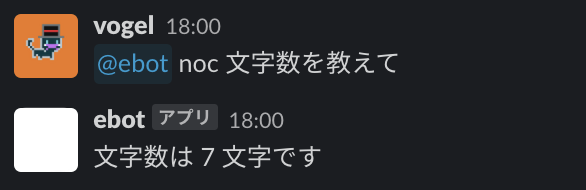

# Slack新プラットフォームを使ったSlack Bot実装

## タスクの種類

新機能追加

## 課題

従来のSlackBotで使用していたホスティングサービス(heroku)の無料枠終了に伴う、
SlackBot移行作業


## 目的

業務効率改善


## 作業内容と方針

Slack CLIを使用して、SlackBotの再実装とデプロイを行う。

メディア運営において記事タイトルを決める際に文字数のカウントが必要なため、文字数カウントできるSlackBotを作成する。

今回の方針として、指定したチャンネルに`@slackbotname noc 文字数カウント` のような形で、メンション+接頭辞を送信した場合に文字数カウントが実行される実装にする。

__（※2022年12月7日現在、今回使用するSlack API betaは有料ワークスペースのみ使用できる技術となっているため、無料ワークスペースでは実装等々を行えません）__


## 該当箇所

KAI-YOU業務用のSlack Workspace

## 実装内容とその解説

#### [Slack CLIで環境構築](https://api.slack.com/future/quickstart)

上記リンクのStep1を参考にしながら、Slack CLIをインストールする。

インストールした後、terminalで`slack login`を実行。
`/slackauthticket ABC123defABC123defABC123defABC123defXYZ`の形の文字列が返ってくるので、コピーし、Slackで自分宛のDMにペーストし実行。

Slack WorkspaceとSlack CLIの連携が完了した後、terminalで `slack create my-app` を実行。

実装方針に合わせたbuildを選択すると、SlackBotのためのコードが展開される。


#### [Slack API beta](https://api.slack.com/future)

今回は、本実装で作成したファイルとその実装説明を記述する。

- [Manifest](https://api.slack.com/future/manifest)

Manifestでは、Slack上で表示されるBotの名前や説明文、アイコンなどのSlackBotに関する設定と、Botの権限スコープ範囲を指定する。

本実装では、Botに対してのメンションをトリガーとし、カウントした文字数をチャンネルに書き込む必要あるため、スコープ範囲は以下にした。

``` tsx
  botScopes: [
    "app_mentions:read",
    "chat:write",
    "chat:write.public",
  ],
```


- [Workflow](https://api.slack.com/future/workflows)

Workflowは、この後実装する起動トリガーのcallback名の設定、使用想定の変数、
使用想定のファンクションを記述する。

各変数の説明として、`text`はチャンネルで入力されたメッセージ文言、`userId`はコマンド入力したユーザーのID、`channelId`はコマンド入力されたチャンネルのIDとなっている。

今回は、文字数をカウントする`CountFunction`と何文字だったかを記載したメッセージを返す`SendFunction`の二つを用いる。

また、WorkflowでaddStepを記述した順にファンクションが実行されるため、以下の実装だと、`CountFunction`が実行された後に`SendFunction`が実行される。

``` tsx
export const Workflow = DefineWorkflow({
  callback_id: "count_chars",
  title: "Count Chars Workflow",
  input_parameters: {
    properties: {
      text: {
        type: Schema.types.string,
      },
      userId: {
        type: Schema.slack.types.user_id,
      },
      channelId: {
        type: Schema.slack.types.channel_id,
      },
    },
    required: ["text", "userId", "channelId"],
  },
});

const countStep = Workflow.addStep(CountFunction, {
  target: Workflow.inputs.text,
});

Workflow.addStep(SendFunction, {
  countMessage: countStep.outputs.countMessage,
  channelId: Workflow.inputs.channelId,
});

export default Workflow;

```


- [Event Trigger](https://api.slack.com/future/triggers/event)

Event Triggerでは、Botにmentionが飛んできたときにBotが起動するeventを指定。
起動時に必要なパラメータはinputsに記述。

Botに対するメンションイベントである`app_mentioned`、
ペラメータはWorkflowで指定したものを記述した。

``` tsx
const trigger: Trigger<typeof Workflow.definition> = {
  type: "event",
  event: {
    event_type: "slack#/events/app_mentioned",
    channel_ids: ["channelId"], // Botが読み書きしたいチャンネルのID
  },
  name: "Mention trigger",
  workflow: "#/workflows/count_chars",
  inputs: {
    "text": {
      value: "{{data.text}}",
    },
    "userId": {
      value: "{{data.user_id}}",
    },
    "channelId": {
      value: "{{data.channel_id}}",
    },
  },
};

export default trigger;
```


- [Functions](https://api.slack.com/future/functions/custom)

カスタムファンクションを実装することで入力値を使った処理を実装することができる。
今回は、接頭辞判定と文字数カウント処理を有した `count.ts`、
判定後のメッセージを送信する `send.ts` の2つを実装した。

`count.ts`は、`inputs_parameters`で入力変数の指定、`output_parameters`で文字数カウント結果のメッセージ本文を返す実装にした。

``` ts
export const CountFunction = DefineFunction({
  callback_id: "count-function",
  title: "Count",
  source_file: "src/functions/count.ts",
  input_parameters: {
    properties: {
      target: {
        type: Schema.types.string,
      },
    },
    required: ["target"],
  },
  output_parameters: {
    properties: {
      countMessage: {
        type: Schema.types.string,
      },
    },
    required: [],
  },
});

export default SlackFunction(CountFunction, ({ inputs }) => {
  const regExp = /\<\@.+?\>\s?(.+)noc (.*)$/;
  let inputText = "";
  const match = inputs.target.match(regExp);
  if (match) {
    inputText = match[2];
  }

  if (!inputText) {
    return { outputs: {} };
  }

  const target = inputText;
  const count = Length(target) / 2;
  const countMessage = `文字数は ${count} 文字です`;
  return { outputs: { countMessage } };
});
```

`send.ts`は、カウント後のメッセージを送信する実装にしている。
`inputs_paremeters`などの実装方法は`count.ts`と同様。

``` tsx
export const SendFunction = DefineFunction({
  callback_id: "send",
  title: "Send",
  description: "Send message",
  source_file: "src/functions/send.ts",
  input_parameters: {
    properties: {
      countMessage: {
        type: Schema.types.string,
      },
      channelId: {
        type: Schema.slack.types.channel_id,
      },
    },
    required: ["channelId"],
  },
});

export default SlackFunction(SendFunction, async ({ inputs, token }) => {
  let message = "";
  console.log(inputs);
  if (inputs.countMessage === undefined) {
    message = "";
  } else {
    message = `${inputs.countMessage}`;
  }

  const client = SlackAPI(token, {});
  message ? await client.chat.postMessage({
    channel: inputs.channelId,
    text: message,
  }) : null;
  return {
    outputs: {},
  };
});

```


#### [Slack CLIでdeploy](https://api.slack.com/future)

デプロイに向け、トリガーをSlack Cloudに登録する必要があるため、以下のコマンドを実行（トリガーファイル名は適宜変更）。
`slack trigger create --trigger-def "triggers/mention.ts"`

トリガー登録先を聞かれるので、開発であれば(dev)、本番であれば(dev)なしを選択。
``` bash
? Choose an app  [Use arrows to move, type to filter]
  my-app
   App ID: N/A   Status: Not installed
   Workspace: myworkspace        Team ID: T123456789

> my-app (dev)
   App ID: N/A   Status: Not installed
   Workspace: myworkspace        Team ID: T123456789
```

本番にリリースする場合、トリガー設定後に `slack deploy` を実行。


### コマンド実行結果



