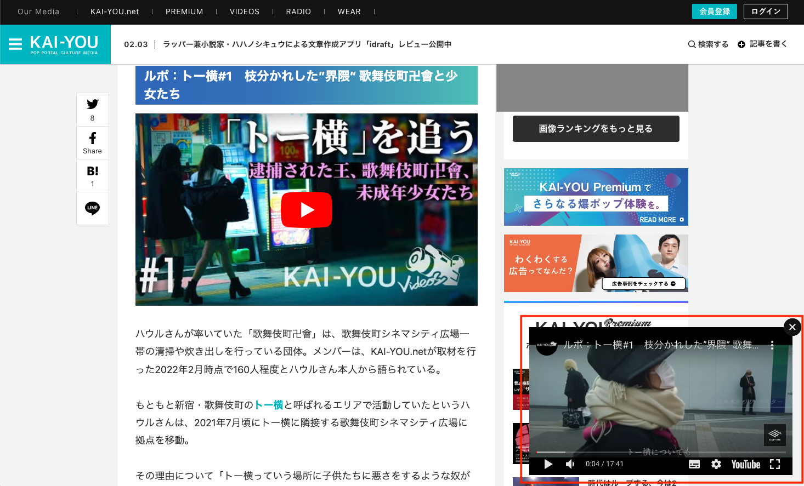

# 擬似ピクチャーインピクチャーの実装


## タスクの種類
新機能追加

---

## 目的
記事中にあるYouTube埋め込みを別枠に用意した1つの動画プレイヤーで再生することによって、
複数ある埋め込み動画の読込み速度改善、及び、記事の可読性向上を図る。

## 作業内容
動画サムネをクリックすると、サイトの右下に「擬似ピクチャーインピクチャー」状態でYouTube埋め込みを再生できる機能を実装していきます。
擬似なので、通常のピクチャーインピクチャーとは異なり、動画が埋め込まれたページでしか再生されません。

用意した要素・処理は以下になっています。

1. 擬似ピクチャーインピクチャー用のdiv枠
2. 埋め込み動画をサムネ画像に変換する処理
3. サムネ画像を押下した時に、用意したdivで再生する処理


### 1. 擬似ピクチャーインピクチャー用のdiv枠
擬似ピクチャーインピクチャーするためには、再生用の追従してくれる枠が必要です。

まず、divを記述していきます。
divの中には、再生するためのsrcが空のiframeを用意します。
サムネ画像をクリックしたタイミングでiframeのsrcを書き換えることによって、該当の動画を再生することができるようになります。

``` html
<div class="l-video-modal">
  <div class="m-video-modal-close"></div>
  <div id="js-video-modal-overlay" class="m-video-modal-overlay">
    <iframe id="js-pip-iframe" width="100%" height="100%" src="" title="YouTube video player" frameborder="0" allow="accelerometer; autoplay; clipboard-write; encrypted-media; gyroscope; picture-in-picture" allowfullscreen="" data-gtm-yt-inspected-8="true"></iframe>
  </div>
</div>
```

非表示にするために、cssで `visibility: collapse;`を記述。
サムネ画像をクリックしたタイミングで、この`visibility`を切り替えて画面に表示します。

```scss
.l-video-modal {
  bottom: 24px;
  height: 286px;
  position: fixed;
  right: 8px;
  visibility: collapse;
  width: 496px;
  z-index: 1;

  @include screen-max (704px) {
    bottom: 80px;
    height: calc(16px * 9  + 16px);
    width: calc(16px * 16 + 16px);
  }

  @media screen and (min-width: 705px) and (max-width: 1056px) {
    bottom: 80px;
  }
}
```


### 2. 埋め込み動画をサムネ画像に変換する処理

php側で記事本文中に含まれる動画埋め込みをサムネ画像に変換します。
ここで、動画を特定できる動画IDもサムネ画像に持たせておきます。
（弊社では現在フレームワークとしてCakePHP 2.*を使用しています。）

```php

private function __buildYoutubeThumbnail($text = '') {
    $pattern = '#src=.*?(?:www\.)?(?:youtube.com/embed/|youtu\.be/)([a-z|0-9|\-|_]*)#i';

    preg_match_all($pattern, $text, $matches);

    foreach ($matches[0] as $i => $match) {
        $id = $matches[1][$i];
        $tag = $this->buildTag(
            "div",
            array(
                "id" => "yt-{$id}",
                "class" => "youtube",
                'style' => "background-image: url('https://kai-you.net/img/common/logo/youtube_red.png'), url('https://img.youtube.com/vi/{$id}/0.jpg')",
                'data-video' => "https://www.youtube.com/embed/{$id}",
                "data-video-id" => $id,
            )
        );

        $pattern = '|^.*' . $match . '.*$|ium';
        $text = preg_replace($pattern, $tag, $text);
        $text = str_replace($tag . "<br />\n<br />", $tag . "<br />", $text);
        $text = str_replace($tag . "<br />\n<br />", $tag . "<br />", $text);
    }

    return $text;
}
```


### 3. サムネ画像を押下した時に、用意したdivで再生する処理

最後に、サムネ画像をクリックしたら擬似ピクチャーインピクチャーできるように、動画読み込み処理と1で用意したdiv枠の表示切り替えをしていきます。


```javascript

embedContentVideosPiPLoad = function () {
    // 再生用iframeのsrcを上書き
    const setYouTubeModal = videoCode => {
        const iframe = document.getElementById('js-pip-iframe');
        iframe.setAttribute('src', "https://www.youtube.com/embed/" + videoCode + "?autoplay=1");
    };

    // モーダルを閉じる場合
    const closeModal = () => {
        const pipPlayer = document.querySelector('.l-video-modal');
        document.querySelector('.m-video-modal-close').addEventListener('click', () => {
            const iframe = document.getElementById('js-pip-iframe');
            const clone = iframe.cloneNode(false);
            clone.setAttribute('src', '');
            iframe.parentNode.replaceChild(clone, iframe)
            pipPlayer.classList.remove('visible-player');
        });
    };

    // モーダルを開く
    const openYouTubeModal = selector => {
        let linksElements = [...document.querySelectorAll(selector)],
            links = linksElements.map(link => link.getAttribute('data-video-id'));
        linksElements.forEach((el, i) => {
            el.addEventListener('click', e => {
                e.preventDefault();
                const pipPlayer = document.querySelector('.l-video-modal');
                const iframe = document.getElementById('js-pip-iframe');
                iframe.setAttribute('src', '');
                const pipIframe = document.getElementById('modalYouTube');
                pipPlayer.classList.add('visible-player');
                setYouTubeModal(links[i]);
            });
            closeModal();
        });
    };

    openYouTubeModal('.youtube');
};
```


### 擬似ピクチャーインピクチャー


