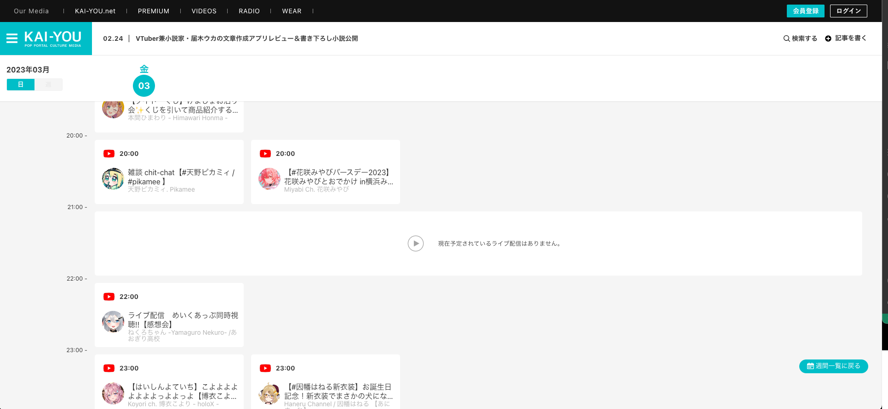
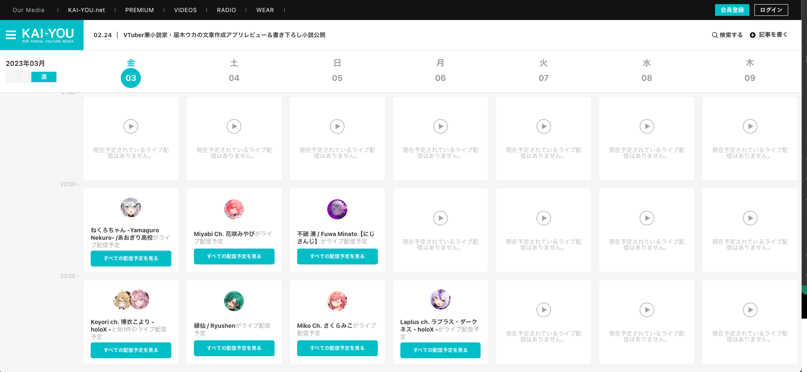

# ストリームカレンダーの実装


## タスクの種類
新機能追加
SEO対策

---

## 目的
弊社で記事として取り上げたり、キーフレーズとして情報を網羅しているYouTuberやVTuber関連のワードに対して、SEOのテーマ性や関連性を高めるため。

## 作業内容
新規機能として、最大1週間単位で表示できるストリームカレンダーの作成を行う。

ストリームカレンダーとは、弊社システムにあらかじめYouTubeチャンネルを登録しておき、登録したチャンネルのYouTube配信予約を取得して、時系列でカレンダー表示するものである。

配信予定データの取得はYouTube DATA APIを使用する。  
以下、実装手順である。


### 1. 配信予定を取得したいチャンネルの動画URLから動画IDを取得

まず、チャンネルIDが現状のYouTubeの使用上わからないため、追加したいチャンネルの動画URLから動画IDを取得する。  
動画IDを使って、動画に関わる情報などが取得できる。  
その中にチャンネルIDがある。

``` php
// 動画URLフルパスから動画IDを抽出
public function trimVideoIdFromVideoUrl(string $videoUrl): string {
    $pattern = '/(http(s|):|)\/\/(www\.|)yout(.*?)\/(embed\/|watch.*?v=|)([a-z_A-Z0-9\-]{11})/i';
    preg_match($pattern, $videoUrl, $videoId);

    return $videoId[6];
}

// YouTube DATA APIを使って動画情報を取得
public function getYoutubeVideoData(string $videoId):array {
    $apiUrl = YOUTUBE_DATA_API_URL;     // YouTube DATA APIのベースになるリクエストURL
    $apiKey = YOUTUBE_DATA_API_KEY;     // YouTube DATA APIへのリクエストに必要なキー

    $options = "&part=snippet&id=" . $videoId;
    $url = $apiUrl . "videos?key=" . $apiKey . $options;

    $detail = $this->curlRequest($url);

    return $detail;
}
```

### 2. 動画一覧を取得

次に、取得したチャンネルIDを使って、YouTube DATA APIに動画一覧を取得リクエストを送る。

``` php
// YoutubeDataAPIで動画一覧を取得
public function getYoutubeVideoListData(string $channelId):array {
    $apiUrl = YOUTUBE_DATA_API_URL;
    $apiKey = YOUTUBE_DATA_API_KEY;

    $options = "&part=snippet&eventType=upcoming&type=video";
    $url = $apiUrl . "search?channelId=" . $channelId . "&key=" . $apiKey . $options;

    $decodedJson = $this->curlRequest($url);

    return $decodedJson;
}
```

### 3. 取得した動画一覧から配信予定の動画情報を取得

2で取得した動画一覧には配信タイトルなどが取得できないので、配信予定詳細を取得できるAPIへリクエスト。
この詳細情報の取得には、動画IDを用いる（配信予定も通常の動画と同じ括りで、動画一覧データから動画IDが取得できる）。

``` php
// 2の処理
$list = $this->StreamSchedule->getYoutubeVideoListData($channelId);
$allScheduleData = [];
if (!empty($list['items'])) {
    foreach ($list['items'] as $index => $item) {
        $videoIds[] = $item['id']['videoId'];
    }
    // 配信予定の詳細データを取得
    $detail = $this->StreamSchedule->getYoutubeLiveStreamingData($videoIds);

    // 取得した配信情報を使って、ストリームカレンダーに必要な情報をDBに格納
    $streamSchedules = $this->StreamSchedule->createStreamChannelSchedules($detail, $streamChannel['StreamChannel']['id'], $channelId);

    $allScheduleData = $this->getStreamSchedules();
}

// YoutubeDataAPIでライブ配信情報を取得
public function getYoutubeLiveStreamingData(array $videoIds):array {
    $apiUrl = YOUTUBE_DATA_API_URL;
    $apiKey = YOUTUBE_DATA_API_KEY;

    $options = "&part=liveStreamingDetails&id=" . implode(',', $videoIds);
    $url = $apiUrl . "videos?&key=" . $apiKey . $options;

    $detail = $this->curlRequest($url);

    return $detail;
}
```

### 4. 定期実行されるコマンドを用意

これまでの実装はチャンネルを追加して、追加タイミングでついでに配信予定を取ってくる処理だったが、
配信予定は都度配信者が時間やタイトルなどを更新するため、定期的に取得してくる必要がある。

以下のようなコマンドを cron などに登録し、定期実行する。

``` php
// 配信予約情報テーブルをtruncate
$this->StreamChannelSchedule->truncate();

// $channels は配信予約を取得したいチャンネル群
foreach ($channels as $channel) {
    $videoIds = [];
    $channelId = $channel['StreamChannel']['channel_id'];

    // 2で実装した動画一覧取得処理
    $list = $this->StreamSchedule->getYoutubeVideoListData($channelId);
    // 下部にあるFunctionでYoutubeDataAPIでチャンネル情報を取得
    $channelData = $this->StreamSchedule->getYoutubeChannelData($channelId);
    if (empty($list['items'][0])) {
        continue;
    }
    foreach ($list['items'] as $index => $item) {
        $videoIds[] = $item['id']['videoId'];
    }
    // 3で実装した配信詳細情報取得処理
    $detail = $this->StreamSchedule->getYoutubeLiveStreamingData($videoIds);
    $streamSchedules = $this->StreamSchedule->createStreamChannelSchedules($detail, $channel['StreamChannel']['id'], $channelId);
}

// YoutubeDataAPIでチャンネル情報を取得
public function getYoutubeChannelData(string $channelId):array {
    $apiUrl = YOUTUBE_DATA_API_URL;
    $apiKey = YOUTUBE_DATA_API_KEY;

    $options = "&part=snippet";
    $url = $apiUrl . "channels?id=" . $channelId . "&key=" . $apiKey . $options;

    $decodedJson = $this->curlRequest($url);

    return $decodedJson;
}
```

### 注意事項

YouTube DATA APIには Quota というコストがあり、リクエスト内容に応じて使用されるQuotaが異なる。
YouTube DATA APIは登録してすぐ利用することが可能だが、Quotaの上限を超えて使用する場合には、YouTube DATA APIへ申請が必要になってくる。

本件は、かなりのQuota使用が見込まれたため、YouTube DATA APIにQuota上限アップ申請をし、数ヶ月かけて今回のカレンダー機能がリリースされた。

やりとりについては「YouTube DATA API クォータ申請」などで検索すればわかるため、今回のレポートでは省く。


### ストリームカレンダー 実際の表示

日別表示


週間表示

