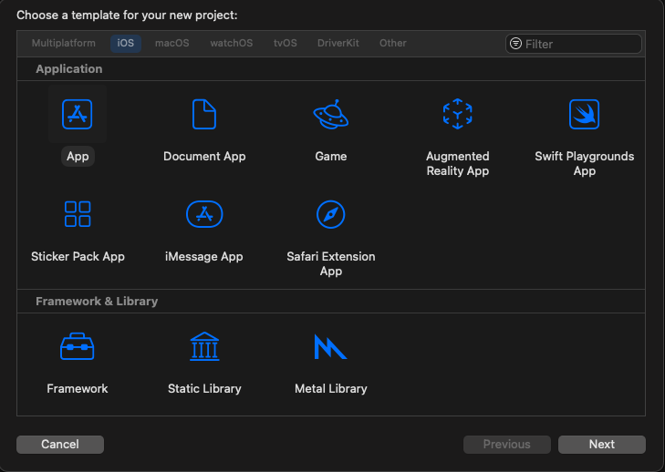
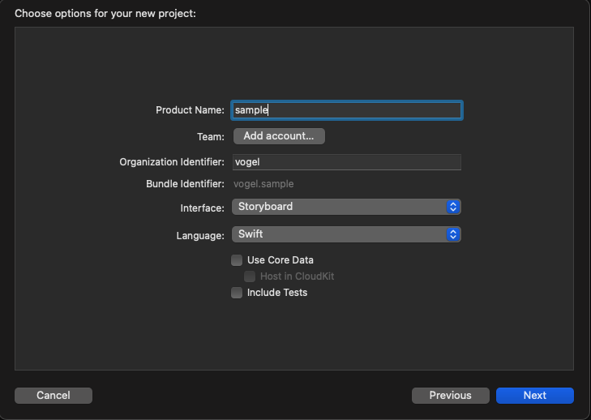
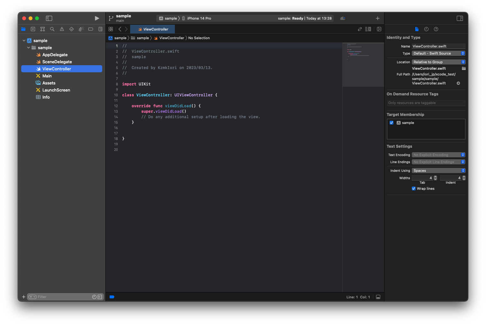
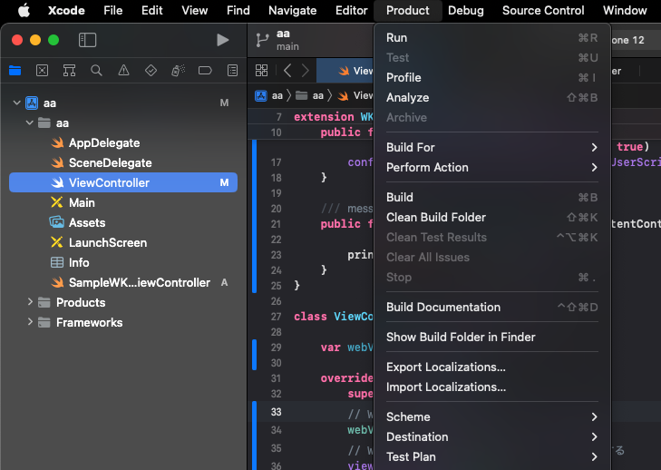
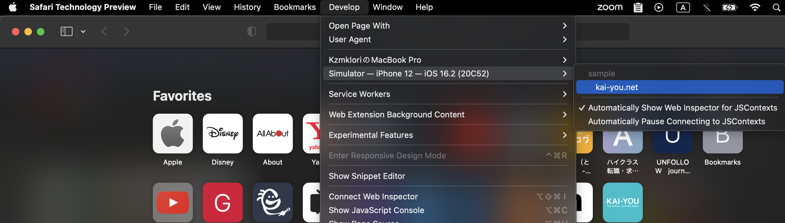
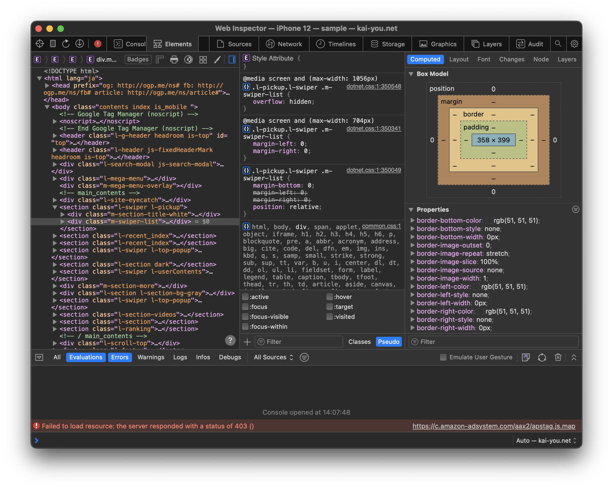

# Xcodeを使ったWebViewデバッグ環境の構築


## タスクの種類
環境構築

---

## 目的
iOSアプリなどで使用されているWebViewでのデバッグ環境を構築する

## なぜ環境を構築するに至ったか
KAI-YOU.netのページにて、Google ChromeやSafariでは動作や表示に問題ないが、  
iOSアプリなどのネイティブアプリで埋め込まれているWebViewにおいて、表示が崩れていたり、動作が不安定な箇所があったため。

## 作業内容
上記のデバッグにあたり、自社でiOSアプリなどWebViewでページを表示できる環境を持っていないので、  
ページをWebViewで表示できるように簡易的な環境を用意する必要がある。

今回、以下の環境で構築した。

* MacOS Venture 13.2.1
* Xcode v14.2
* Safari Technology Preview v16.4

主に、Xcodeの実装や機能を使ったデバッグになる。  
通常、SafariでもデバッグのためのWebインスペクタが存在しているが、今回使用するXcodeに含まれているソフトウェア「iOS Simulator」においては、Safari Technology PreviewでないとWebインスペクタが表示されないため、こちらを使用する。  
以下に、Xcodeの実装とデバッグ方法を記述した。


### 1. Xcodeの実装

WebViewを表示するために、簡易的なWebView表示アプリを実装する。

Xcodeを起動し、「New Project」を選択、テンプレートは「App」を選択する。



プロジェクトのインターフェースなどのオプションを設定してくださいと言われるので、  
下記画像のように設定。



「Next」ボタンを押し、「Create」ボタンを押下すると、設定した内容で新しいプロジェクトが作成される。




作成された「ViewController」ファイルを以下の実装に変更する。
（※URLリクエスト先のURLをデバッグしたいURLに書き換えておく）

``` swift
import Foundation
import UIKit
// WebKitをimportする
import WebKit

class ViewController: UIViewController {

    var webView: WKWebView!

    override func viewDidLoad() {
        super.viewDidLoad()
        // WKWebViewを生成
        webView = WKWebView(frame: view.frame)
        // WKWebViewをViewControllerのviewに追加する
        view.addSubview(webView)
        // リクエストを生成
        let request = URLRequest(url: URL(string: "https://kai-you.net/")!)
        // リクエストをロードする
        webView.load(request)
    }
}

```

実装変更が完了したら、Xcodeを開いた状態で上部に位置するバーから、
「Product」→「Run」を実行する。



問題なく実行されるとiOS Simulatorが起動する。  
iPhoneの起動が完了し次第、「ViewController」で記述したURLがWebViewで開かれる。


### 2. Safari Technology Previewでデバッグする

1にてWebViewで起動している状態で、デバッグを行う。

Safari Technology Previewを起動し、「Develop」→「起動しているiOS SimulatorのiPhone」→「Sample（記述したURL）」を選択する。



WebViewのインスペクタが開かれるので、そこでConsoleなどのエラーを解消したり、擬似的デバッグを行うことができる




## 参考
[SafariのデベロッパーツールとiOS SimulatorでWebサイトやアプリをデバッグ](https://blanche-toile.com/web/web-devtools-ios-simulator)

